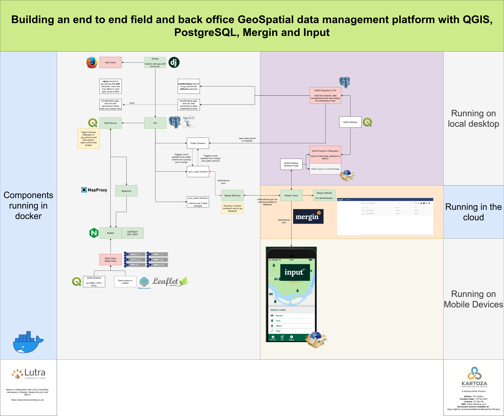
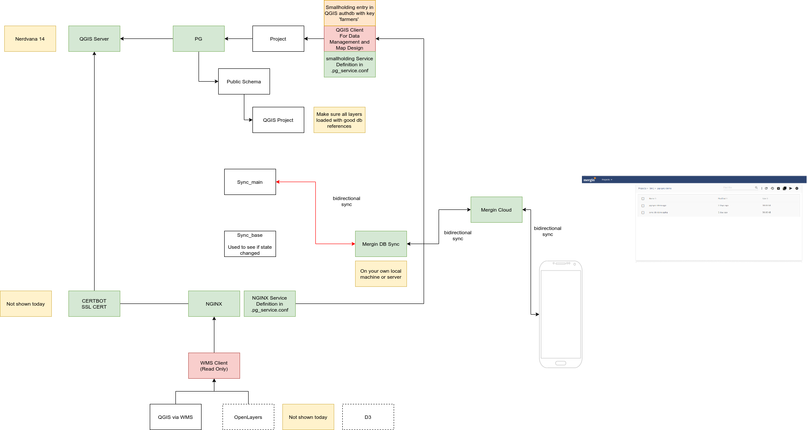

# Introduction

This project provides a platform for creating, sharing and publishing data and maps using an Open Source GIS Stack. It has two primary objectives:

1. Provide a platform that integrates these technologies:
   1. One or more [QGIS](https://qgis.org) Projects
      1. Projects stored in-database in PostgreSQL
      2. Projects stored in the file system
   2. QGIS Server
      1. Publishing projects stored on the files system
      2. Publishing projects stored in the database
   3. Field data collection and project synchronisation support:
      1. The [Mergin](https://public.cloudmergin.com/#) platform for cloud storage of projects
      2. The [INPUT](https://inputapp.io/en/) mobile data collection platform
      3. The [Mergin-db-sync](https://github.com/lutraconsulting/mergin-db-sync) tool that will synchronise a Mergin cloud project into a PostgreSQL project.
   6. [PostgreSQL](https://postgresql.org) and [PostGIS](https://postgis.net/) running in Docker and providing a database backend for our stack.
   7. [NGINX](https://www.nginx.com/) a lightweight web server acting as a proxy in front of QGIS server and as a server for the static HTML content.
   8. [QGIS Server](https://docs.qgis.org/3.16/en/docs/) to serve QGIS projects from the database and from the file system.
   9. [QGIS Server Docker Image](https://github.com/gem/oq-qgis-server) from OpenQuake.
   10. [Apache Superset](https://superset.apache.org/) to provide dashboard visualisations

## Overview Diagram




# Preparing the server

## Basic Security

### Unattended upgrades

This will automatically install only security fixes on a continual basis on your server.

```
sudo apt install unattended upgrades
```

### ssh

Disable password authentication for SSH

```
sudo vim /etc/ssh/sshd_config
```

Set this:

```
PasswordAuthentication no
Then do
sudo systemctl restart sshd.service
```

### Crowdsec

https://crowdsec.net/ 


```
wget -qO - https://s3-eu-west-1.amazonaws.com/crowdsec.debian.pragmatic/crowdsec.asc |sudo apt-key add - && echo "deb https://s3-eu-west-1.amazonaws.com/crowdsec.debian.pragmatic/$(lsb_release -cs) $(lsb_release -cs) main" | sudo tee /etc/apt/sources.list.d/crowdsec.list > /dev/null;
sudo apt-get update
sudo apt-get install crowdsec
```

### Fail2ban

```
sudo apt install fail2ban
https://www.fail2ban.org/wiki/index.php/Main_Page 
```


### Firewall

```
sudo ufw allow ssh
sudo ufw enable
sudo ufw status
```

Should show something like this:

```
Status: active

To             Action   From
--             ------   ----
22/tcp           ALLOW    Anywhere         
22/tcp (v6)        ALLOW    Anywhere (v6)
```

We will open more ports as they are needed.

### Status monitoring

bpytop is a great console based dashboard for monitoring your server.

```
sudo snap install bpytop
```

## Additional Software

### Docker

```
sudo apt install docker.io docker-compose
```

### Git, rpl, pwgen and Make

Needed for checking out our docker project and running the various make commands we provide.

```
sudo apt install git make rpl pwgen
```


# Deploying the server

Note for the unprivileged user throughout here, we use the user name 
‘timlinux’  in various examples - you should substitute this with your own user.

## User Group

Add yourself to the user group of docker so you don't need to sudo docker commands.

```
sudo usermod -a -G docker timlinux
```

Then log out and in again to assume the upgraded permissions.

## Project Checkout

```
cd /home
sudo mkdir web
sudo chown timlinux.timlinux web
cd web
git clone https://github.com/kartoza/OpenSource-GIS-Stack
cd OpenSource-GIS-Stack
```

## Fetching Docker Images


## Configuration

Copy the .env boilerplate file and then adjust any settings in it as needed.

```
cp .env.example .env
```

Replace terms that should be unique for your installation:

```
rpl example.org geoservices.govt.lc .env
rpl example.org geoservices.govt.lc nginx_conf/nginx.conf 
```


# SCP File Drop Service

This is a container intended for users to upload files for publication on the server. It runs on port 2222 so we need to expose that through the firewall:

```
sudo ufw allow 2222
```

You can add your public keys from the host e.g.

```
cat ~/.ssh/authorized_keys > scp_conf/gis_projects
```

Or copy them in by other means. Each file you create in scp_conf will be a user name when the scp container runs, with it’s own directory in the storage volume, unless an explicit storage volume has been pre-defined (see list of these below). Each file should contain a list of public keys. If you add a key at some point, or a new user file, you may need to restart the container:

```
docker-compose profile=scp restart
```

The following scp shares are made for the various purposes listed below. You need to follow the same pattern of creating a config file for each. These shares each have a dedicated volume associated with it which is also mounted into the associated server container.


User Key File in scp_config	Named Volume	Mounted To	Notes

* **User:** geoserver_data
* **Named Volume:** scp_geoserver_data
* **Volume Mounted To:**	scp, geoserver	
* **Notes:** Copy vector and raster datasets here for publishing in GeoServer.
* **Example Use:** ``sftp://geoserver_data@<hostname>:2222/home/geoserver_data``
  


* **User:** qgis_projects
* **Named Volume:** scp_qgis_projects
* **Volume Mounted To:** scp, qgis-server
* **Notes:** Copy QGIS projects and data here for publishing with QGIS Server. See notes on directory layout below.
* **Example Use:** ``sftp://qgis_projects@<hostname>:2222/home/qgis_projects``
  


* **User:** qgis_svgs
* **Named Volume:** scp_qgis_svgs
* **Volume Mounted To:** scp, qgis-server
* **Notes:** Embed SVGs in styles by preference in QGIS. Use this drop if you have no way to use embeded SVGS.
* **Example Use:** ``sftp://qgis_svgs@<hostname>:2222/home/qgis_svgs`


* **User:** qgis_fonts
* **Named Volume:** scp_qgis_fonts
* **Volume Mounted To:** scp, qgis-server
* **Notes:** Copy fonts directly into the root folder.
* **Example Use:** ``sftp://qgis_fonts@<hostname>:2222/home/qgis_fonts``


* **User:** hugo_data
* **Named Volume:** scp_hugo_data
* **Volume Mounted To:** scp, hugo*
* **Notes:** Upload markdown files for static site generation with Hugo.
* **Example Use:** ``sftp://hugo_data@<hostname>:2222/home/hugo_data``


* **User:** odm_data
* **Named Volume:** scp_odm_data
* **Volume Mounted To:** scp, odm *
* **Notes:** Upload imagery data for processing with ODM
* **Example Use:** ``sftp://odm_data@<hostname>:2222/home/odm_data``


* **User:** general_data
* **Named Volume:** scp_general_data
* **Volume Mounted To:** scp
* **Notes:** General sharing directory. Later we  will publish this under nginx for public downloads. Don’t put any sensitive data in here.
* **Example Use:** ``sftp://general_data@<hostname>:2222/home/general_data``

**Note:** Any user connecting to any of these shares will be able to see all other files from all other users. They will only have write access to the folder they are connecting to, for all other shares their access will be read only. If you want to further partition the access to files you can create multiple scp services, each with one of the mount points listed above. In so doing users would not be able to see the other mount points listed above.

## Directory layout for the QGIS projects folder

When adding projects to the qgis_projects folder, you need to follow this convention strictly for the projects to be recognised by QGIS Server:

``qgis_projects/<project_name>/<project_name>.qgs``

For example:

``qgis_projects/terrain/terrain.qgs``

There is a convenience Make target that will copy your .ssh/authorized_keys file contents into each of the scp_config user files listed in the table above.


``make setup-scp``

## Starting the container

``docker-compose --profile=scp up -d scp``

Example copying of data into the container from the command line:

``scp -P 2222 sample-document.txt localhost:/data//gis_projects/gis_projects/gis_projects``

In Nautilus (file manager in Linux Gnome Desktop) you can test by connecting 

``sftp://<hostname>:2222/data/gis_projects``

into the red highlighted box below:

XXXXXXXXXXXXXXXXXXXX


After that open a second window and you can drag and drop files too and from the folder.
Windows users can use the free WinSCP application to copy files to the server.  

## FAQ

**Q:** When connecting I get “Host key validation failure” or similar
**A:** Remove the entry for the server in your ~/.ssh/known_hosts


# Postgres and PostGIS

## Overview

We use the Kartoza PostGIS docker image available here: https://hub.docker.com/r/kartoza/postgis/ 

The project home page is here: https://github.com/kartoza/docker-postgis

The project includes detailed documentation so this section only contains details relevant to the Open Source GIS Stack configuration.

## Configuration

### Database password:
Generate a strong password:

``pwgen 20  1``

Replace the default docker password for the postgres user with the strong password:

```
rpl “POSTGRES_PASSWORD=docker” “POSTGRES_PASSWORD=<strong password>” .env
```

### Service file configuration:

Service files entries serve two scenarios:

1.	They are needed for opening QGIS projects stored in postgres with PG connection URI because at the project URI you cannot use QGIS authdb. If you prefer to store your projects on the file system, you should rather remove these lines (whole nginx section) since the authentication from pg_conf/pg_service.conf can be done more securely by QGIS authdb.
2.	Used by your QGIS Server projects to connect to the database once the project is opened from either the file system of the database.  You can either specify your password and username in service file or for more advanced configuration you can store user / password credentials in a QGIS authdb file. Refer to the authdb section and in qgis_conf/qgis-auth.db and the readme in that folder.

On your local machine you should create your own service file with the same service name but connection details that make sense when using the database from your local machine. When you upload your projects into the stack they will connect using the settings from the server hosted service file below assuming you used the same service name.

To carry out the service file configuration, copy, rename then edit the pg_service file in pg_config as per the example below (note that we also substitute in the database password created in the steps above).

```
cp pg_conf/pg_service.conf.example \ pg_conf/pg_service.confpassword=docker 
rpl password=<your password> pg_conf/pg_service.conf
```

### Deployment

```
docker-compose --profile=postgres up -d
```

Note that the default configuration opens the postgresql service to all hosts. This is a potential security hole. If you open the port on the firewall e.g.

```
ufw allow 5432 tcp
```

Then be sure to connect from pg clients like psql or QGIS with SSL enabled so that passwords and data are not transmitted in clear text.

### Validation

Create a local pg_service.conf file like the example below and save it in ``~/.pg_service.conf`` or similar as appropriate to your operating system (see https://www.postgresql.org/docs/12/libpq-pgservice.html for details on configuration options).

```
[os-gis-stack]
dbname=gis
port=5432
host=<hostname of your server>
user=<your password>
password=docker
```

Now pass the server parameter to psql and list the databases as per the example below:


```
[timlinux@fedora ~]$ psql service=os-gis-stack -l
List of databases
```

   Name    |  Owner   | Encoding | Collate |  Ctype  |   Access privileges   
-----------|---------|----------|---------|---------|-----------------------
 gis       | docker   | UTF8     | C.UTF-8 | C.UTF-8 | 
 postgres  | postgres | UTF8     | C.UTF-8 | C.UTF-8 | 
 template0 | postgres | UTF8     | C.UTF-8 | C.UTF-8 | =c/postgres          |
 template1 | postgres | UTF8     | C.UTF-8 | C.UTF-8 | =c/postgres          |

``(4 rows)``

Test from QGIS is similar:

XXXXXXXXXXXXXX


Note that there was no need to supply any credentials other than the service file name.


# Production Stack

## Overview

In this section we will bring up the full production stack, but to do that we first need to get an SSL certificate issued. To facilitate this, there is a special, simplified, version of Nginx which has no reverse proxies in place and not docker dependencies. Here is an overview of the process:

1.	Replace the domain name in your letsencrypt init script
2.	Replace the email address in your letsencrypt init script
3.	Replace the domain name in the certbot init nginx config file
4.	Open up ports 80 and 443 on your firewall
5.	Run the init script, ensuring it completed successfully
6.	Shut down the minimal nginx
7.	Replace the domain name in the production nginx config file
8.	Generate passwords for geoserver, postgres, postgrest and update .env
9.	Copy over the mapproxy template files
10.	Run the production profile in docker compose

At the end of the process you should have a fully running production stack with these services:

IMAGE | PORTS | NAMES
------|-------|-------
kartoza/mapproxy | 8080/tcp |                                   osgisstack_mapproxy_1
nginx | 0.0.0.0:80->80/tcp, 0.0.0.0:443->443/tcp |  osgisstack_nginx_1
swaggerapi/swagger-ui |        80/tcp, 8080/tcp |                  osgisstack_swagger_1
postgrest/postgrest |          3000/tcp  |   osgisstack_postgrest_1 
kartoza/geoserver:2.18.0  |    8080/tcp, 8443/tcp  |  osgisstack_geoserver_1
openquake/qgis-server:stable | 80/tcp, 9993/tcp | osgisstack_qgis-server_1
kartoza/postgis:13.0 | 0.0.0.0:5432->5432/tcp  | osgisstack_db_1
quay.io/lkiesow/docker-scp |   0.0.0.0:2222->22/tcp | osgisstack_scp_1
certbot/certbot | 80/tcp, 443/tcp | osgisstack_certbot_1

The following ports will be accessible on the host to the docker services. You can, on a case by case basis, allow these through your firewall using ufw (uncomplicated firewall) to make them publicly accessible:

1.	80 - http:Only really needed during initial setup of your letsencrypt certificate
2.	443 - https: All web based services run through this port so that they are encrypted
3.	5432 - postgres: Only expose this publicly if you intend to allow remote clients to access the postgres database. 
4.	2222 - scp: The is an scp/sftp upload mechanism to mobilise data and resources to the web site

For those services that are not exposed to the host,  they are generally made available over 443/SSL via reverse proxy in the Nginx configuration.

Some things should still be configured manually and deployed after the initial deployment:

1.	Mapproxy configuration
2.	setup.sql (especially needed if you are planning to use postgrest)
3.	Hugo content management
4.	Landing page static HTML

And some services are not intended to be used as long running services. especially the ODM related services.
Configuration

We have written a make target that automates steps 1-10 described in the overview above. It will ask you for your domain name, legitimate email address and then go ahead and copy the templates over, replace placeholder domain names and email address, generate passwords for postgres etc. and then run the production stack. Remember you need to have ufw, rpl, make and pwgen installed before running this command:


```
make configure
```


# GeoServer Configuration

Remind user to set the master password as per https://docs.geoserver.geo-solutions.it/edu/en/security/security_overview.html#the-master-password (which is different to the admin password).


--------------------------------------------
SCRAP

--------------------------------------------

These are legacy notes to be removed or carefully incorporated into the notes above as necessary.


## Generalised Workflow



## Getting started

## Checkout submodules

```
git submodule update --init --recursive
```

## Define your domain name

This repo contains a worked example of running the stack as described above. 
There are numerous references to the testing domain 'castelo.kartoza.com' in 
various configuration files that should be replaced with your own
preferred domain name before running any of these images. One simple way to
do so is to install the 'rpl' command line tool and then replace all instances 
of the aforementioned domain named e.g.: 

sudo apt install rpl
rpl castelo.kartoza.com your.domain.com *

After doing that make sure you have a valid DNS entry pointing to your host - 
you will need this for the Certbot/Letsencrypt bot to work.

Similarly there is a reference to my email in the letsencrypt init script
which you need to change to your own email address in ``init-letsencrypt.sh``.

## Initialise Certbot

Make sure the steps above have been carried out then run the init script.

``
./init-letsencrypt.sh
``

After successfully running it will terminate wiith a message like this:

```
### Requesting Let's Encrypt certificate for castelo.kartoza.com ...
Saving debug log to /var/log/letsencrypt/letsencrypt.log
Plugins selected: Authenticator webroot, Installer None
Requesting a certificate for castelo.kartoza.com
Performing the following challenges:
http-01 challenge for castelo.kartoza.com
Using the webroot path /var/www/certbot for all unmatched domains.
Waiting for verification...
Cleaning up challenges

IMPORTANT NOTES:
 - Congratulations! Your certificate and chain have been saved at:
   /etc/letsencrypt/live/castelo.kartoza.com/fullchain.pem
   Your key file has been saved at:
   /etc/letsencrypt/live/castelo.kartoza.com/privkey.pem
   Your certificate will expire on 2021-05-30. To obtain a new or
   tweaked version of this certificate in the future, simply run
   certbot again. To non-interactively renew *all* of your
   certificates, run "certbot renew"
 - If you like Certbot, please consider supporting our work by:

   Donating to ISRG / Let's Encrypt:   https://letsencrypt.org/donate
   Donating to EFF:                    https://eff.org/donate-le


### Reloading nginx ...
2021/03/01 22:50:52 [notice] 33#33: signal process started
```

If you have any issues checking out the certificate etc. then 
check the nginx logs:

``
docker-compose logs -f nginx
``

## Check Services

After the above steps, a subset of the services will be running. 

``
docker-compose ps
``

Which should show something like this:


```
             Name                           Command                  State                   Ports             
---------------------------------------------------------------------------------------------------------------
maceiramergindbsync_db_1         /bin/sh -c /scripts/docker ...   Up (healthy)   0.0.0.0:15432->5432/tcp       
maceiramergindbsync_geoserver_   /bin/sh /scripts/entrypoint.sh   Up (healthy)   8080/tcp, 8443/tcp            
1                                                                                                              
maceiramergindbsync_mapproxy_1   /start.sh mapproxy-util se ...   Up             8080/tcp                      
maceiramergindbsync_nginx_1      /docker-entrypoint.sh /bin ...   Up             0.0.0.0:443->443/tcp,         
                                                                                 0.0.0.0:80->80/tcp            
maceiramergindbsync_postgrest_   /bin/sh -c exec postgrest  ...   Up             0.0.0.0:32779->3000/tcp       
1                                                                                                              
maceiramergindbsync_qgis-        /bin/sh -c /usr/local/bin/ ...   Up             80/tcp,                       
server_1                                                                         0.0.0.0:32780->9993/tcp       
maceiramergindbsync_swagger_1    /docker-entrypoint.sh sh / ...   Up             80/tcp, 0.0.0.0:3001->8080/tcp
```

Before we bring up the OSM mirror and the Mergin Sync serviice we need to do some additional 
configuration. In the next subsection we will set up the OSM mirror clip region:


## Set Your Clip Region


## Building mergin-db-sync

Mergin db sync is not currently in docker hub, so you need to build the docker image yourself. 
First check out the [mergin-db-source](https://github.com/lutraconsulting/mergin-db-sync).


```
make redeploy-mergin
```

Note: They do now have an image available - need to swap to using that in docker-compose

## Initialise the superset database

The first time you run, you need to configure superset by using the init container:

```
docker-compose up superset-init
```

Doing that will create a user with credentials admin/admin

There is also a config file in ``superset_conf/superset_config.py`` which manages permissions for 
public users. 


You need to also assign the following permissions to the Public role:


```
[can csrf token on Superset, can explore json on Superset, can explore on Superset, can dashboard on Superset, datasource access on [smallholding].[vw_vegetation_points](id:4)]
```

I also made a Public user which is linked to the Gamma role:


That public user needs to be given access to each chart that you want to publicly share in your dashboards:


Lastly, that public user also needs to be given access to each dashboard that you want to publicly share:


Once you have that in place, you should be able to share dashboards that do not need users to log in.


See also https://github.com/apache/superset/issues/7763 and https://superset.apache.org/docs/security .


## Bring up remaining services


```
docker-compose up -d
```

Note that some services are intended to be run once only so you may see errors e.g. for odm which you can ignore.

## Essential Reading

### QGIS Server

You should read the [QGIS Server documentation](https://docs.qgis.org/3.16/en/docs/server_manual/getting_started.html#) on QGIS.org. It is well written and covers a lot of background explanation which is not provided here. Also you should familiarise yourself with the [Environment Variables](https://docs.qgis.org/3.16/en/docs/server_manual/config.html#environment-variables).

Alesandro Passoti has made a number of great resources available for QGIS Server. See his [workshop slide deck](http://www.itopen.it/bulk/FOSS4G-IT-2020/#/presentation-title) and his [server side plugin examples](https://github.com/elpaso/qgis3-server-vagrant/tree/master/resources/web/plugins), and [more examples here](https://github.com/elpaso/qgis-helloserver).

### QGIS Server Atlas Print Plugin

See the [project documentation](https://github.com/3liz/qgis-atlasprint/blob/master/atlasprint/README.md#api) for supported request parameters for QGIS Atlas prints.

### Docker OSM

See how the imposm3 mapping syntax works here: https://imposm.org/docs/imposm3/latest/mapping.html

<<<<<<< HEAD
## Generating Vector Tiles

See https://gis.stackexchange.com/a/292358 on how to export your postgresql data base layers to vector mbtiles and https://gdal.org/drivers/raster/mbtiles.html for the config file format. See also the PG provider docs here: https://gdal.org/drivers/vector/pg.html

For example here we convert our OSM mirror to an mbtiles vector tile store:

ogr2ogr -f MBTILES target.mbtiles PG:"dbname='gis' host='localhost' port='15432' user='docker' password='docker'" -dsco MAXZOOM=10

### RTK GPS in Input

Check out https://twitter.com/complementterre?s=20 Julien Ancelin's work for making a low budget RTK GPS receiver for use with INPUT
=======
## Vector tiles

A great primer on vector tiles, particularly with relevance to QGIS. https://wanderingcartographer.wordpress.com/2021/01/09/qgis-3-and-vector-map-tiles/

>>>>>>> 40760fd9aff5dd3890249977f8837d9899794ca4

### PostgREST

Take special note of the fact that the passing of environment variables to the docker container is 
desribed [here](chttps://postgrest.org/en/v7.0.0/install.html#docker). Especially this line:

> These variables match the options shown in our Configuration section, except they are capitalized, have a PGRST_ prefix, and use underscores. 

So for example ``openapi-server-proxy-ur`` would become ``PGRST_OPENAPI_SERVER_PROXY_URI``.

This latter environment variable is important by the way to present a public url for the api running inside the docker container.

I based some of my Nginx configuration on the excellent example [by Johnny Lambada](https://github.com/johnnylambada/docker-postgrest-swagger-sample).

## Loading Raster Layers

Here is how I loaded raster data into the database:

Flags used:

```
-d Drop table, create new one and populate it with raster(s) 
-t TILE_SIZE Cut raster into tiles to be inserted one per table row. TILE_SIZE
   is expressed as WIDTHxHEIGHT or set to the value "auto" to allow the loader to
   compute an appropriate tile size using the first raster and applied to all
   rasters. 
-F Add a column with the name of the file
-I Create a GiST index on the raster column. 
-s <SRID> Assign output raster with specified SRID. If not provided or is zero,
   raster's metadata will be checked to determine an appropriate SRID. 
-l OVERVIEW_FACTOR Create overview of the raster. For more than one factor,
   separate with comma(,). Overview table name follows the pattern o_overview
   factor_table, where overview factor is a placeholder for numerical overview
   factor and table is replaced with the base table name. Created overview is
   stored in the database and is not affected by -R. Note that your generated sql
   file will contain both the main table and overview tables.
```
(Above copied directly from raster2pgsql help docs)


```
echo "create schema raster;" | psql -h localhost -p 15432 -U docker gis
cd /home/timlinux/gisdata/Maceira/orthophoto
raster2pgsql -s 32629 -t 256x256 -C -l 4,8,16,32,64,128,256,512 -P -F -I odm_orthophoto.tif raster.orthophoto | psql -h localhost -p 15432 -U docker gis
cd /home/timlinux/gisdata/Maceira/elevation
raster2pgsql -s 32629 -t 256x256 -C -l 4,8,16,32,64,128,256,512 -d -P -F -I dtm.tif raster.dtm | psql -h localhost -p 15432 -U docker gis
raster2pgsql -s 32629 -t 256x256 -C -l 4,8,16,32,64,128,256,512 -d -P -F -I dsm.tif raster.dsm | psql -h localhost -p 15432 -U docker gis
cd -
```

*Note* this project includes automation for creating ODM mosaics and 
loading them into Postgresql - see the Makefile odm related tasks.


## Authentication Management

[Some discussion](http://osgeo-org.1560.x6.nabble.com/QGIS-Server-qgis-auth-db-td5408912.html)
suggest to set authdb configuration parameters in Apache/Nginx but I found it
would only work if I set these in the environment of the QGIS Server docker
container.

## Hugo

See this for notes on how to automate publishing from github.

https://humanitec.com/blog/how-to-deploy-hugo-website


## Other Notes

### Fonts

Fonts used in this project are from Google Fonts, checked out using:

```
git clone git@github.com:google/fonts.git
```
