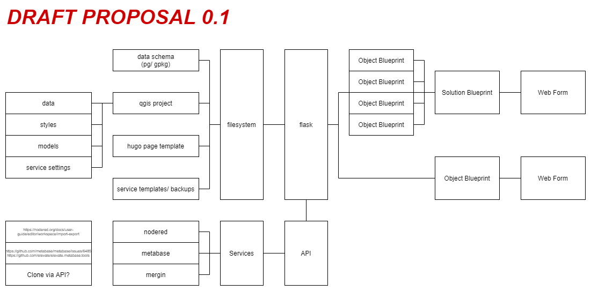

# About Blueprints

Blueprints have not been implemented at this time.

The concept of blueprints is to have separate apparatus and automation processes that allow for the reproducibility and , with tight integration of the solution with OSGS components.

The initial (draft) proposal is to develop a separate application which handles the configuration of blueprints (from an end-user/ UX perspective). This configuration would then be used to execute a series of steps, such as loading of dashboard templates etc, which may either be used to deploy a configurable solution, or as a project scaffolding to build and extend existing solutions.

Blueprints would handle discrete and individual tasks, such as publishing a web map service or creating a new article. Multiple blueprints could then be configured into a single end-to-end solution.

This concept is illustrated by the diagram below.

## Difference between blueprints and processes

Processes are manual steps taken to perform some action or achieve some objective, using the various tools available within the stack. These are in effect the building blocks for blueprints, which may depend on some manual processes to be implemented, but more effectively leverage existing resources, community templates, and have a focus on clean UX, ease of use, automation, and reproducibility.

An example of a solution would be the replication of a COVID dashboard for a particular region of interest.

The basic evolution of an end-to-end solution is basically as follows:

process(es) >> workflow(s) >> resources >> blueprint(s) >> solution

Resources could be configuration files, template data, and other assets, the structure of which may vary between blueprints.

It would probably make sense to just use json as the default for config elements.
