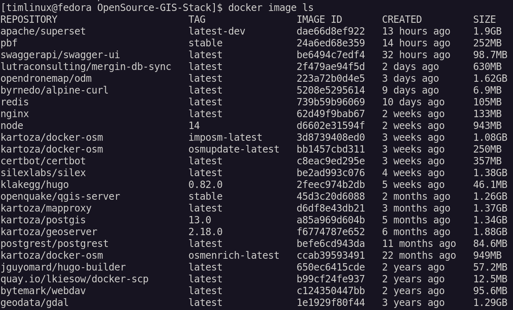

# Initial Configuration

<div class="admonition warning">
Note for the unprivileged user throughout here, we use the user name ‘timlinux’
in various examples - you should substitute this with your own user.
</div>

## User Group

Add yourself to the user group of docker so you don't need to sudo docker
commands.

```
sudo usermod -a -G docker $USER

```

On linux you can run:

```
newgrp docker 
```

To become part of the docker group. On other Operating Systems you should log out and in again to assume the upgraded permissions.

## Project Checkout

Note you can check out the project anywhere, but for our examples we will use /home/web/osgs.

```
cd /home
sudo mkdir web
sudo chown timlinux.timlinux web
cd web
git clone https://github.com/kartoza/osgs
cd osgs
```

<div class="admonition warning">
At this time we do not use the snapd installation of docker. Note that if you do,
you will need to install osgs in your home directory. See snapd docker notes 
for details.
</div>

## Configuration

### On a local host

If you are going to use a self-signed certificate on a localhost (for testing) use:


```
make configure-ssl-self-signed
```

>**Note**: Make sure to set the `Domain name` and `Owner Url` to `localhost` when prompted. 


The static website will be available on https://localhost/.

### On a name host

If you are going to use a letsencrypt signed certificate on a name host (for production) use:


```
make configure-letsencrypt-ssl
```

## Fetching Docker Images

You can optionally prefetch all the docker images that are used in the stack.



```
docker-compose pull
```
