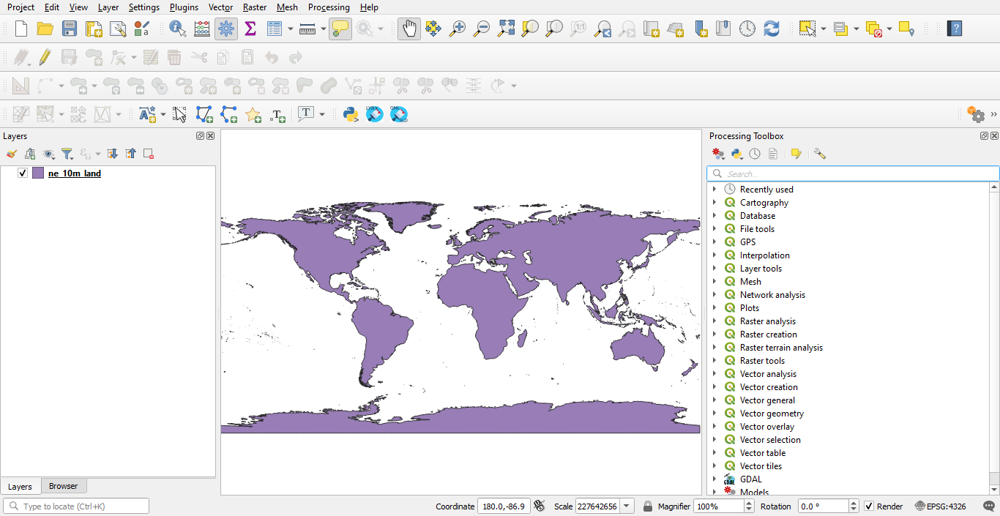
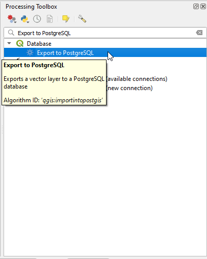
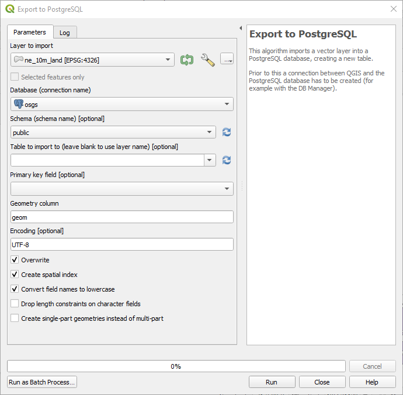
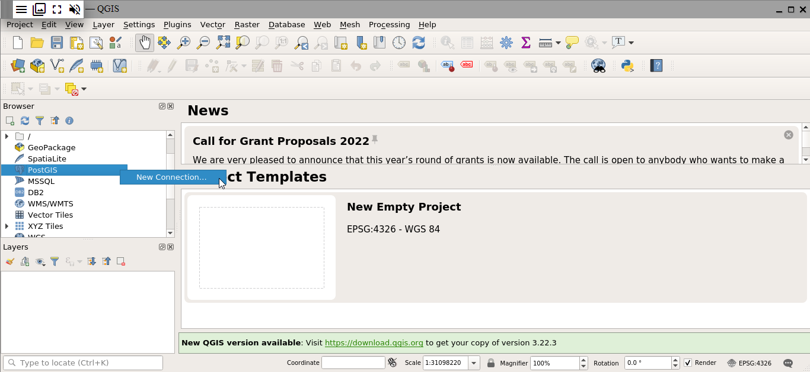
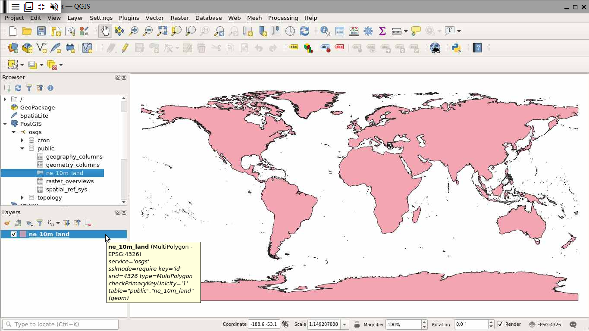

# Accessing PostGIS from QGIS using a pg_service file

## Deploy the initial stack

In your server terminal, deploy the initial stack by running either `make configure-ssl-self-signed` or `make configure-letsencrypt-ssl`. The initial stack consists of the Nginx, Hugo Watcher and Watchtower services.

Use `make configure-ssl-self-signed` if you are going to use a self-signed certificate on a localhost for testing. Use `make configure-letsencrypt-ssl` if you are going to use a Let's Encrypt signed certificate on a name host for production. The `make configure-ssl-self-signed` will deploy the Nginx, Hugo Watcher and Watchtower services, but after running `make configure-letsencrypt-ssl` you will need to run `make deploy-hugo` to deploy the Nginx, Hugo Watcher and Watchtower services.

Use `make ps` to view the services running. The following services should be up:


## Deploy the PostgreSQL and PostGIS service

Deploy the PostgreSQL and  PostGIS service using `make deploy-postgres`. If you already have PostgreSQL installed on your local machine, ensure that you specify a different port number for the Postgis Public Port other than port 5432, the default port for PostgreSQL. For example, you can use the port number 5434.


Use `make ps` to view the services running. The following services should be up:


The PostgreSQL and PostGIS service has the following databases: 


In this workflow, you will be connecting to the `gis` database.

## Using the pg_service file on the client side of the stack (where it references the external port)

### Edit your local connection service file

On your local machine, the per-user connection service file can be at `~/.pg_service.conf` or the location specified by the environment variable `PGSERVICEFILE`.  Add a service to this connection service file with the following service name and connection parameters. 
```
[osgs]
dbname=gis
user=docker
port=<POSTGRES_PUBLIC_PORT>
password=<POSTGRES_PASSWORD>
host=
sslmode=require
``` 
For the port and password connection parameters, use the `POSTGRES_PUBLIC_PORT` and  `POSTGRES_PASSWORD` specified in the `.env` file. For the host connection parameter, use the hostname of the server where you have set up OSGS.

For more information on the PostgreSQL connection service file see the [PostgreSQL documentation](https://www.postgresql.org/docs/current/libpq-pgservice.html).

### Setting up your PostGIS connection in QGIS (locally)

QGIS Desktop can be downloaded from [here](https://qgis.org/en/site/forusers/download.html) and installed using [these instructions](https://qgis.org/en/site/forusers/alldownloads.html).

On your local machine, open QGIS Desktop.  In your Browser Panel,  right click on the PostGIS option and click on "New Connection". This will open the Create a New PostGIS Connection dialogue.


In the Connection Information section, give the connection an appropriate name. For the service, enter the service name that you specified in the [connection service file](#creating-your-local-connection-service-file). Set the SSL mode to `require` and ensure you have enabled the `Also list tables with no geometry` and the `Allow saving/loading QGIS projects in database` options. Once all the configuration options have been set, click on "Test Connection". Once you see the `Connection to <Name> was successful` message, click "OK". You have now successfully connected to the PostgreSQL and PostGIS service `gis` database. 


### Loading data into the `gis` database

There are multiple ways to load vector data into a PostGIS database. Some of them are:
* using the PgAdmin Browser
* using the ogr2ogr commandline utility
* using the shp2pgsql conversion utility
* using the QGIS DB Manager
* using the "Export to PostgreSQL" Database option from the Processing Toolbox in QGIS.
* using the "Export to PostgreSQL" GDAL options in QGIS
  
To load raster data into a PostGIS database some of the tools you can use are the:
* the PgAdmin Browser
* the raster2pgsql conversion tool

In this workflow, you will be using the "Export to PostgreSQL" Database option from the Processing Toolbox in QGIS to export a vector layer from QGIS to the `gis` database, creating a new relation.

First, download the Natural Earth Land dataset from this [link](https://www.naturalearthdata.com/http//www.naturalearthdata.com/download/10m/physical/ne_10m_land.zip). Unzip the downloaded `ne_10m_land.zip` file then drag and drop the `ne_10m_land.shp` shapefile into QGIS.



In the Processing Toolbox Panel, search for the "Export to PostgreSQL" option and double-click on the result in the Database category.



In the Export to PostgreSQL dialogue specify the following parameters and click "Run". More information on each of these parameters is provided [here](https://docs.qgis.org/3.16/en/docs/user_manual/processing_algs/qgis/database.html#export-to-postgresql).



Once the export is done, you should see an `Algorithm 'Export to PostgreSQL' finished` message in the Log. In the Browser Panel, click on Refresh. You will see the `ne_10m_land` table in the `public` schema.


## Using the pg_service file on the server side of the stack (where it references the internal port)

### Creating the server-side connection service file

To create the server-side connection service file, run the command `cp conf/pg_conf/pg_service.conf.example conf/pg_conf/pg_service.conf` in the terminal. In the `conf/pg_conf/pg_service.conf` file, add a service with the same name as the service you set up in the `pg_service.conf` file on your local machine. The service should have the following service name and connection parameters. 
```
[osgs]
dbname=gis
user=docker
port=<POSTGRES_PRIVATE_PORT>
password=<POSTGRES_PASSWORD>
host=db
sslmode=require
```
For the port and password connection parameters, use the `POSTGRES_PRIVATE_PORT` and `POSTGRES_PASSWORD` specified in the `.env` file. For the host connection parameter specify the hostname as `db`.

### Setting up your PostGIS connection in the QGIS Desktop service

Deploy the QGIS Desktop service using `make deploy-qgis-desktop`. Use `make ps` to view the services running. The following services should be up:


The QGIS Desktop service is now accessible on `/qgis-desktop/` e.g. `https://localhost/qgis-desktop/`. Log in to the service using the username `<NGINX_AUTH_USER>` and password `<NGINX_AUTH_PWD>` specified in the `.env` file. 

In your Browser Panel,  right click on the PostGIS option and click on "New Connection". This will open the Create a New PostGIS Connection dialogue. 



In the Connection Information section, give the connection an appropriate name. For the service, enter the service name that you specified in the [connection service file](#creating-the-server-side-connection-service-file). Set the SSL mode to `require` and ensure you have enabled the `Also list tables with no geometry` and the `Allow saving/loading QGIS projects in database` options. Once all the configuration options have been set, click on "Test Connection". Once you see the `Connection to <Name> was successful` message, click "OK". You have now successfully connected to the PostgreSQL and PostGIS service `gis` database. 


In your Browser Panel click on Refresh. You will see under the PostGIS option our new PostGIS connection. In the public schema you will find the `ne_10m_land` table which we added in the previous [section](#loading-data-into-the-gis-database). Double click on the table to add it as a vector layer in QGIS. 

