# Authentication of Postgres using a pg_service file and a qgis-auth.db file.

This workflow will demonstrate how to access Postgres in QGIS using a pg_service file and a qgis-auth.db file.

## Deploying the OSM Mirror service

### Prepare the Country PBF file and the clip area document

The PBF files for the country or region of interest can be obtained from [GeoFabrik](https://download.geofabrik.de/). The PBF file used in this workflow was for South Korea and the URL is https://download.geofabrik.de/asia/south-korea-latest.osm.pbf.

The clip area constrains any data being imported into the PostGIS database to a specific geographic area. You will need to save the clip area document as `conf/osm_conf/clip.geojson`. For best performance, a simple rectangle is best, but any complex polygon can be used. The CRS of the geojson should always be `EPSG:4326`.


You can easily create such a clip document at  https://geojson.io or by using QGIS. For this workflow the clip area document for Seoul, South Korea, was downloaded from the [southkorea/seoul-maps](https://github.com/southkorea/seoul-maps/blob/master/juso/2015/json/seoul_municipalities_geo_simple.json) repository.

### Deploy the initial stack

In your server terminal, deploy the initial stack by running either `make configure-ssl-self-signed` or `make configure-letsencrypt-ssl`. The initial stack consists of the Nginx, Hugo Watcher and Watchtower services.

Use `make configure-ssl-self-signed` if you are going to use a self-signed certificate on a localhost for testing. Use `make configure-letsencrypt-ssl` if you are going to use a Let's Encrypt signed certificate on a name host for production. The `make configure-ssl-self-signed` will deploy the Nginx, Hugo Watcher and Watchtower services, but after running `make configure-letsencrypt-ssl` you will need to run `make deploy-hugo` to deploy the Nginx, Hugo Watcher and Watchtower services.

Use `make ps` to view the services running. The following services should be up:


### Deploy the PostgreSQL and PostGIS service

Deploy the PostgreSQL and  PostGIS service using `make deploy-postgres`. If you already have PostgreSQL installed on your local machine, ensure that you specify a different port number for the Postgis Public Port other than port 5432, the default port for PostgreSQL. For example, you can use the port number 5434.


Use `make ps` to view the services running. The following services should be up:


### Deploy the OSM mirror service

Deploy the OSM mirror service using `make deploy-osm-mirror` and follow the subsequent prompts. Use `make ps` to view the services running. The following services should be up:


You can view the logs for the OSM mirror service using the command `make osm-mirror-logs`.

## Deploying QGIS Server

To deploy the QGIS Server service, run `make deploy-qgis-server`. Use `make ps` to view the services running. The following services should be up:


## Deploying the File Browser service

To deploy the File Browser service run `make deploy-file-browser`. The file browser service can now be accessed on `/files/` e.g. https://localhost/files.

Use `make ps` to view the services running. The following services should be up:

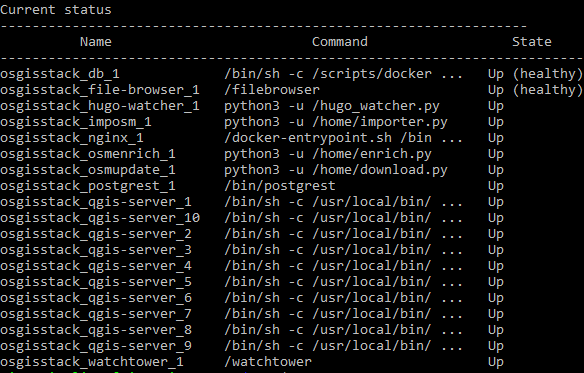

## Editing your local connection service file

On your local machine (where you have QGIS Desktop installed), the per-user connection service file can be at `~/.pg_service.conf` or the location specified by the environment variable `PGSERVICEFILE`. Add a service to this connection service file with the following service name and connection parameters.

```
[osgs]
dbname=gis
port=<POSTGRES_PUBLIC_PORT>
host=
sslmode=require
``` 

For the host connection parameter, use the hostname of the server where you have set up OSGS.

## Setting up your PostGIS connection in QGIS Desktop

On your local machine, open QGIS Desktop.  In your Browser Panel,  right click on the PostGIS option and click on "New Connection". This will open the Create a New PostGIS Connection dialogue.


In the Connection Information section, give the connection an appropriate name. For the service, enter the service name that you specified in the [connection service file](#editing-your-local-connection-service-file). Set the SSL mode to `require` and ensure you have enabled the `Also list tables with no geometry` and the `Allow saving/loading QGIS projects in database` options.

In the Configurations tab of Authentication section, click on the "plus" icon to create a new authentication configuration.

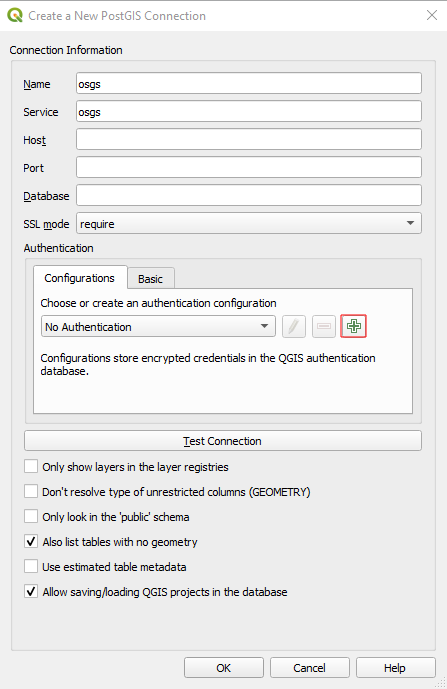

If prompted, set a new master password. You must define a master password to store or access sensitive information within the QGIS authentication database. For more details on the QGIS authentication system, see the [QGIS documentation](https://docs.qgis.org/3.16/en/docs/user_manual/auth_system/auth_overview.html#authentication-database).


Give the new authentication configuration an appropriate name. Ensure the authentication method is set to `Basic authentication`. For the username and password parameters, use the POSTGRES_USER and POSTGRES_PASSWORD specified in the `.env` file. Click "Save". These credentials are now saved in the QGIS authentication database `qgis-auth.db`. 

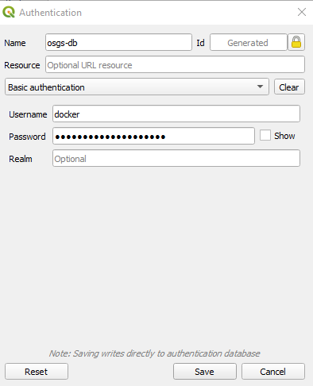

From the Configurations drop down, select the name of the authentication configuration you just created above.


Once all the configuration options have been set, click on "Test Connection". Once you see the `Connection to <Name> was successful` message, click "OK". You have now successfully connected to the PostgreSQL and PostGIS service `gis` database.


### View the authentication configuration ID

To view the ID for the authentication configuration you created in the above section, go to Configurations in the Authentication tab of the QGIS options dialogue (Settings>>Options).

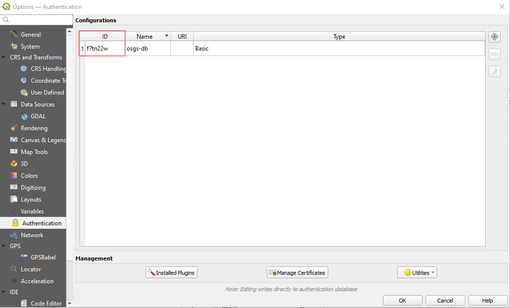

## Create a QGIS project from the OSM Mirror layers

In the QGIS Browser Panel, select the `osm_admin`, `osm_waterways_rivers` and `osm_waterways_streams` layers from the `osm` schema and add them to a new QGIS project. Save the project in the Postgres service `gis` database using Project>>Save To>>PostgreSQL.


Save the project in the `public` schema of the osgs connection and name it `seoul_rivers`.

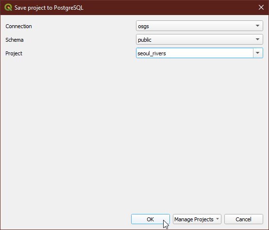

The project is now saved in the `qgis_projects` table in the `public` schema of the `gis` database.

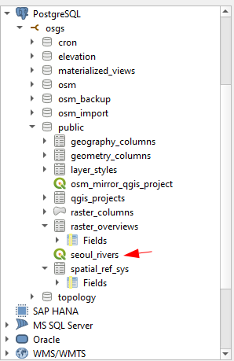

## Upload the qgis-auth.db file

The file browser service can be accessed on `/files/` e.g. https://localhost/files. The url will direct you to the Login page. Sign in to the service using the File Browser username `<FILEBROWSER_USER>` and password `<FILEBROWSER_PASSWORD>` specified in the `.env` file.


Navigate into the `qgis_conf/auth-db/` folder in File Browser. Delete the `qgis-auth.db` file in the folder.

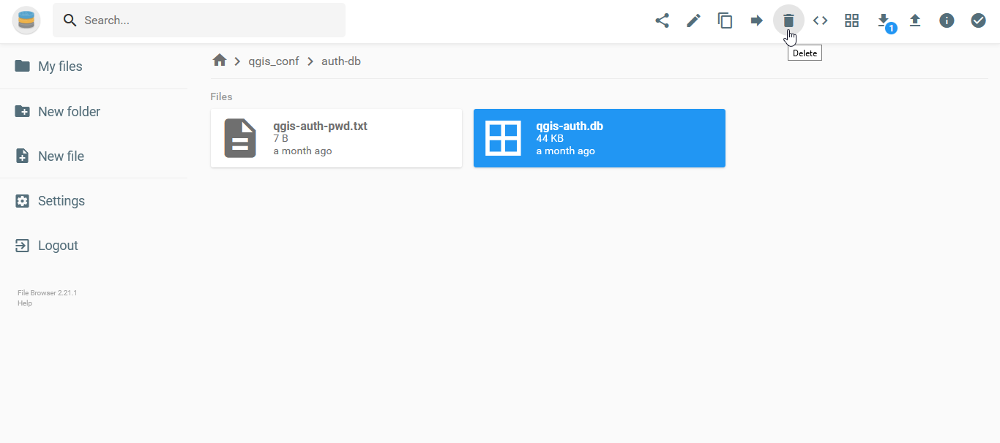

Upload the `qgis-auth.db` file located in your QGIS Active Profile Folder. This is the QGIS authentication database containing the authentication configuration you created in the [Setting up your PostGIS connection in QGIS Desktop section](#setting-up-your-postgis-connection-in-qgis-desktop).  This can be accessed via Settings>>User Profiles>>Open Active Profile Folder.

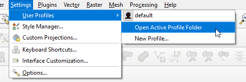

Remove the default string `123456` from the `auth-db/qgis-auth-pwd.txt` file and add the master password to unlock the `auth-db/qgis-auth.db` file you have just uploaded. Remember to save your edits to the file before exiting the text file.

>**Note**: Make sure to upload the `qgis-auth.db` file whenever you change it.

## Creating the server-side connection service file

To create the server-side connection service file, run the command `cp conf/pg_conf/pg_service.conf.example conf/pg_conf/pg_service.conf` in the server terminal. In the `conf/pg_conf/pg_service.conf` file, add a service with the following service name and connection parameters.Ensure the service name you use in the server-side connection service file is the same as the service name you used in the [local connection service file](#editing-your-local-connection-service-file). 

```
[osgs]
dbname=gis
port=5432
host=db
sslmode=require
```

For the port connection parameter, use the `POSTGRES_PRIVATE_PORT` specified in the `.env` file. For the host connection parameter specify the hostname as `db`.

## Editing the `qgis-server.conf` file

Edit the `conf/nginx_conf/locations/qgis-server.conf` file by replacing the default PostgreSQL connection string `postgresql://?service=nginx&sslmode=disable&schema=public&project=smallholding` in the `location /qgis-pg/` section of the file with the PostgreSQL connection string `postgresql:?service=osgs&authcfg=f7tn22w&sslmode=require&dbname&schema=public&project=seoul_rivers` and save the changes. The `authcfg` parameter is the ID of the [authentication configuration](#view-the-authentication-configuration-id) containing the username and password for the Postgres service `gis` database.

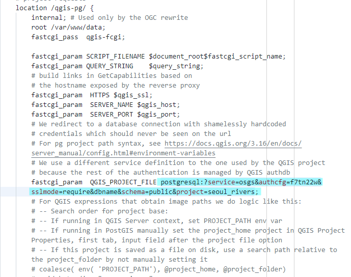

Restart the QGIS Server service using `make restart-qgis-server`.

## Using QGIS Desktop as a web service client for QGIS Server published layers

In your QGIS Desktop Browser panel, right click on the `WMS/WMTS` option and create a new connection.


Give the new connection an appropriate name. For the URL parameter, access the published QGIS project via `/map/` i.e. `https://<server name>/map/`. The `<server name>` parameter is the hostname of the server where you set up OSGS. Click "OK".

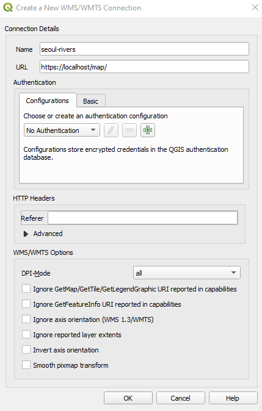

Once the connection is successful, you can now load into QGIS the project or individual layers as WMS layers. Drag and drop the layers onto the Map View to view the project.

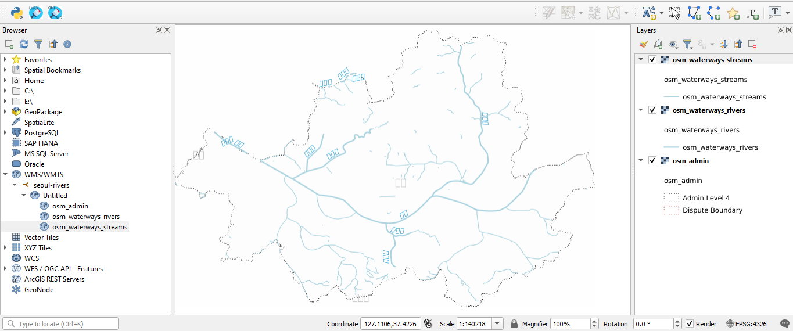
