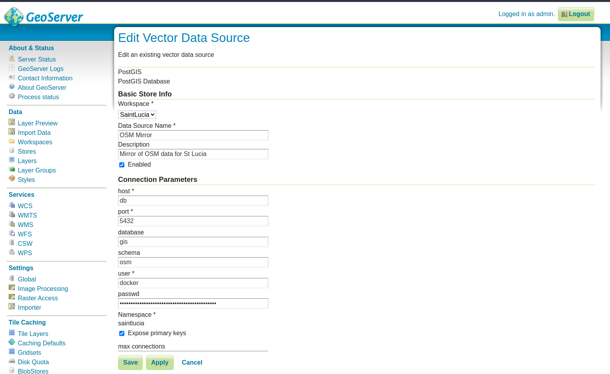
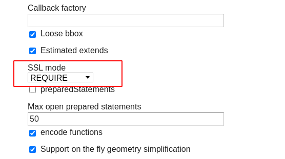

# Creating an Open Street Map mirror into your database

The OSM mirror service uses the kartoza/docker-osm tool to create an in-database
mirror of a designated geographical area in the designated postgres
database schema (set to: osm). The OSM mirror tool is described in the project
README here:

https://github.com/kartoza/docker-osm

To deploy the osm-mirror service, you need to follow the steps descibed below.


## Preparing the Country PBF file and the clip area document

The PBF files for the country or region of interest can be downloaded from [GeoFabrik](https://download.geofabrik.de/). The PBF file used in this workflow was for Kenya and the URL for the country PBF file is https://download.geofabrik.de/africa/kenya-latest.osm.pbf.

The clip area constrains any data being imported into the PostGIS database to a specific geographic area. You will need to save the clip area document as `conf/osm_conf/clip.geojson`. For best performance, a simple rectangle is best, but any complext polygon can be used. The `clip.geojson` can also be the same extent of the administrative area for your country or region specified in the PBF file, or it can be a smaller extent. The CRS of the geojson should always be EPSG:4326.[[1]](#1)


You can easily create such a clip document at  https://geojson.io or by using QGIS. For this workflow the clip area document for the country Kenya, was obtained using QGIS. The Kenya country boundary data was obtained from the [Kenya- Subnational Administrative Boundaries data](https://data.humdata.org/dataset/ken-administrative-boundaries).


## Editing the mappings.yml  file. 

For advanced users, you can tweak the ``osm_conf/mapping.yml``. To customize the OSM data being imported into the PostGIS database. 

You can see how the imposm3 mapping syntax works here: 

https://imposm.org/docs/imposm3/latest/mapping.html

> **Note**: You cannot alter the ```mappings.yml``` file after the service is running without
clearing the database (using ```make stop-osm-mirror```) and restarting the import (using ```make deploy-osm-mirror```).

## Deploying the OSM mirror service. 

To deploy the initial stack, which includes the  Nginx and Hugo watcher services, please run either  `make configure-ssl-self-signed` or `make configure-letsencrypt-ssl`. 

Next deploy the Postgres service using `make deploy-postgres`. If you have PostgreSQL already installed outside of the stack (on your local machine) ensure that you specify a different Postgres public port number other than the default 5432. For example, you can use the port number 5434 for the public port. 

After deploying the Postgres service, set up the ```.pg_service.conf``` file on your local machine using the instructions provided [here](https://www.postgresql.org/docs/9.0/libpq-pgservice.html).
Your osgs service should look like this:

```
[osgs]
dbname=gis
user=docker
port=
password=
host=
sslmode=require
```

For the port and password configuration parameters, use the Postgres public port number (POSTGRES_PUBLIC_PORT) and Postgres password (POSTGRES_PASSWORD) specified in the ```.env``` file. For the host configuration parameter use the hostname of the server where you have set up OSGS. 

To deploy the OSM mirror service, run the `make deploy-osm-mirror` command and follow the subsequent instructions. You can view the logs for the OSM mirror service using the command `make osm-mirror-logs`. 

To use the OSM mirror layers in the Postgis database in QGIS, use the service name ```osgs``` and the port number you used to set up the ```osgs``` service  in the ```.pg_service.conf``` file to create a new PostGIS connection in QGIS. Make sure to the set the SSL mode to require. 


## Loading the default OSM mirror QGIS project.

To load the default OSM mirror QGIS project, in the ```qgis_projects``` table, in the ```public``` schema, double click on the ```osm_mirror_qgis_project```. The project layers will load onto the QGIS **Map View**.


## Loading the OSM Mirror Layers into QGIS

The imported Open Street Map layers for the clip area specified are present in the `osm` schema of the database. 


To load a layer from the `osm` schema onto the QGIS Map View, double click on the table or drag and drop the table onto the Map View. 


## Saving a QGIS project into the OSM database

In the **Menu Toolbar** click on **Project**. From the drop down menu select **Save To** **PostgreSQL**. 


Save the project in the `public` schema and name the project. In this example we have named the project `qgis projects`.


## Backing up and restoring a QGIS project into the database

To back up the QGIS project created in the previous section, run the command `make backup-db-qgis-project`. This backs up the `qgis_projects` table in the `public` schema as a `.sql` file named `QGISProject.sql`.

To restore a backed up QGIS project, name the `.sql` file `QGISProject.sql` and place the file in the `backups` folder then run the command `restore-db-qgis-project`. 

## Saving QGIS layer styles into the database

To save the style of a layer into the database, right click on the layer in the **Layers Panel** and select **Properties**. 


In the Symbology section of the Layer Properties, click on **Style** > **Save style**. 


In the Save Layer Style dialogue select **In Database (postgres)** and name the style file. You can add an optional description of the style and also set the style to be the default style for the layer.  


The saved style is added as an entry in the `layer_styles` table in the `public` schema of the PostGIS OSM database. 


## Backing up and restoring the QGIS styles into the database

To back up the QGIS styles created in the previous section, run the command `make backup-db-qgis-styles`. This backs up the `layer_styles` table in the `public` schema as a `.sql` file named `QGISStyles.sql`.  

To restore a back up of the QGIS styles, name the back up file `QGISStyles.sql` and place it in the `backups` folder then run the command `make restore-db-qgis-styles`. 

## Publishing with GeoServer

You can publish the OSM mirror layers in the ```osm``` schema using GeoServer or by publishing a QGIS project that references the layers in the ```osm``` schema.

The steps for publishing with GeoServer are quite simple:

1. Log in to GeoServer using the 'admin' user and the password in .env.

2. Create a new store of type 'Postgis' and configure it as per the screenshot below, replacing the password with the Postgres password stored in .env:

   

    Also, be sure to scroll down and set SSL mode to Required:

   


3. Register one or more layers from that store as per the image below:
   
   

4. Complete the layer details as appropriate and make sure to click the options highlighted in red in the screenshot below:

   

5. Connect to the GeoServer from a client e.g. QGIS using WFS or WMS using the scheme:

    	https://example.org/geoserver/SaintLucia/wfs

    or

        https://example.org/geoserver/SaintLucia/wms

   


## Publishing with QGIS Server

The workflows described in the section on working with the PostgreSQL database are basically all you need to know, so we don't repeat that here, other than to remind you that the OSM mirrored data is by default stored in a schema called ```osm```.

## References 

<a id="1">[1]</a> Kartoza. (n.d.). GitHub - kartoza/docker-osm: A docker compose project to setup an OSM PostGIS database with automatic updates from OSM periodically. GitHub. Retrieved August 30, 2021, from https://github.com/kartoza/docker-osm#readme