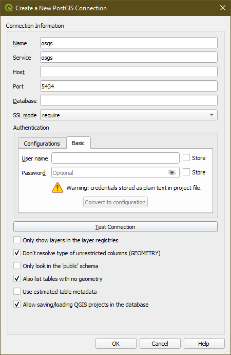
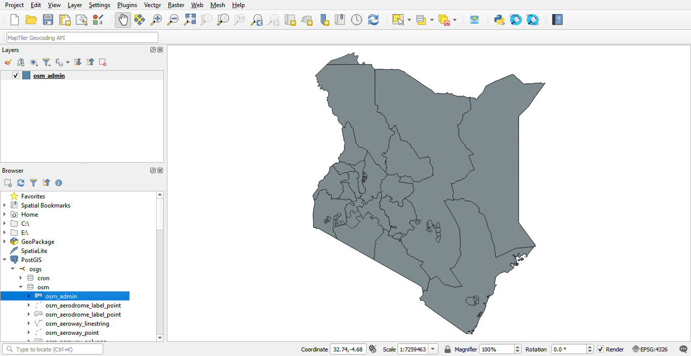
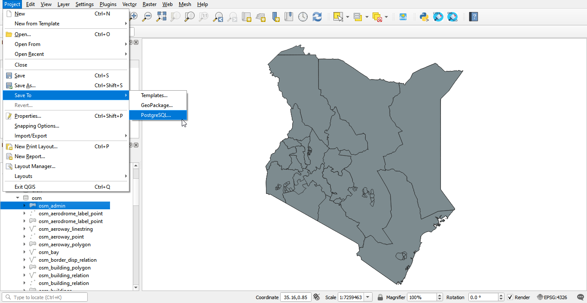
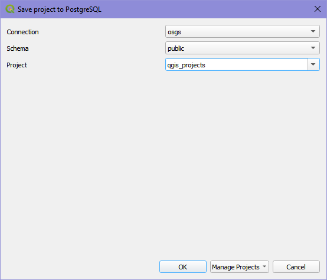
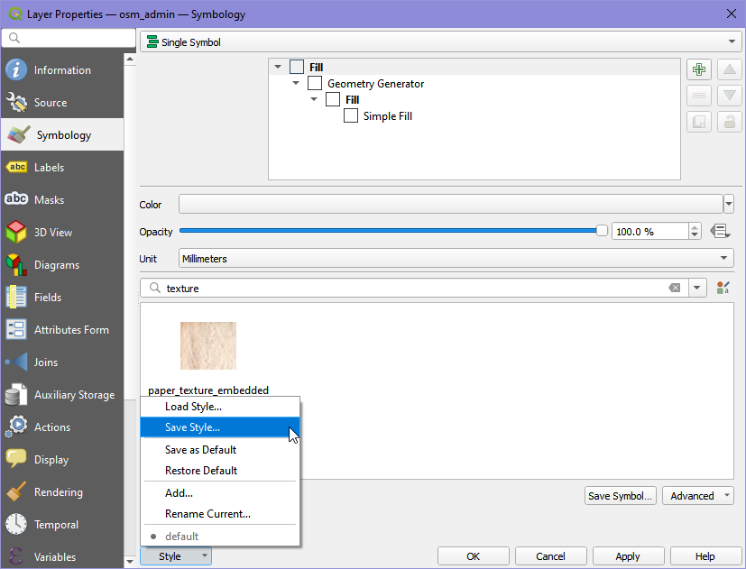
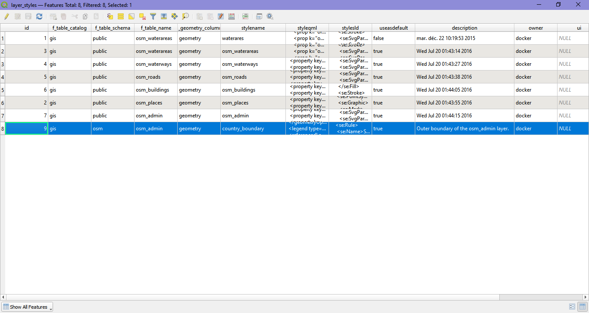

# Creating an Open Street Map mirror into your database

## Preparing the Country PBF file and the clip area document

The PBF files for the country or region of interest can be downloaded from [GeoFabrik](https://download.geofabrik.de/). The PBF file used in this workflow was for Kenya and the URL for the country PBF file is https://download.geofabrik.de/africa/kenya-latest.osm.pbf.

The clip area allows you to limit the features being imported into the PostGIS OSM database to a small area you can work with. You will need to save the clip area document as `conf/osm_conf/clip.geojson`. The `clip.geojson` can be the same extent of the administrative area for your country or region specified in the PBF file, or it can be a smaller extent. The CRS of the geojson should always be EPSG:4326.[[1]](#1)

You can easily create such a clip document at  https://geojson.io or by using QGIS. For this workflow the clip area document for the country Kenya, was obtained using QGIS. The Kenya country boundary data was obtained from the [Kenya- Subnational Administrative Boundaries data](https://data.humdata.org/dataset/ken-administrative-boundaries).

## Deploying the OSM mirror service. 

To deploy the initial stack, which includes the  Nginx, Hugo watcher and SCP services, please run either  `make configure-ssl-self-signed` or `make configure-letsencrypt-ssl`. 

Next deploy the Postgres service using `make deploy-postgres`. If you have PostgreSQL already installed outside of the stack (on your local machine) ensure that you specify a different Postgres public port number other than the default 5432. For example, you can use the port number 5434 for the public port. 

To deploy the OSM mirror service, run the `make deploy-osm-mirror` command and follow the subsequent instructions. You can view the logs for the OSM mirror service using the command `make osm-mirror-logs`. 

## Loading the OSM Mirror Layers into QGIS

To use the layers in the OSM Postgis database in QGIS, use the Postgres public port number, username and password contained in the `.env` file to create a connection to the PostGIS OSM database `gis` in QGIS. Make sure to the set the SSL mode to require. 

The imported Open Street Map layers for the clip area specified are present in the `osm` schema of the database. 

To load a layer from the `osm` schema onto the QGIS Map View, double click on the table or drag and drop the table on the Map View. 

## Saving a QGIS project into the OSM database

In the **Menu Toolbar** click on **Project**. From the drop down menu select **Save To** **PostgreSQL**. 

Save the project in the `public` schema and name it `qgis projects` to allow the `make backup-db-qgis-project` command to be able to create a back up of the project. 

## Backing up and restoring a QGIS project into the database

To back up the QGIS project created in the previous section, run the command `make backup-db-qgis-project`. This backs up the `qgis_projects` table in the `public` schema as a `.sql` file named `QGISProject.sql`.

To restore a backed up QGIS project, name the `.sql` file `QGISProject.sql` and place the file in the `backups` folder then run the command `restore-db-qgis-project`. 

## Saving QGIS layer styles into the database

To save the style of a layer into the database, right click on the layer in the **Layers Panel** and select **Properties**. 

In the Symbology section of the Layer Properties, click on **Style** > **Save style**. 

In the Save Layer Style dialogue select **In Database (postgres)** and name the style file. You can add an optional description of the style and also set the style to be the default style for the layer.  

The saved style is added as an entry in the `layer_styles` table in the `public` schema of the PostGIS OSM database. 

