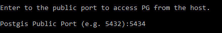
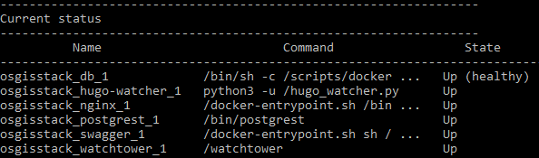
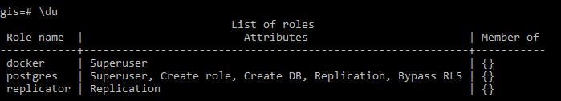
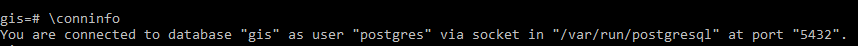
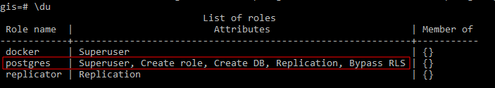
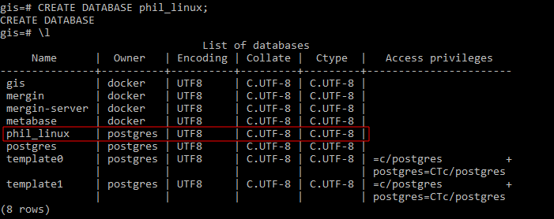
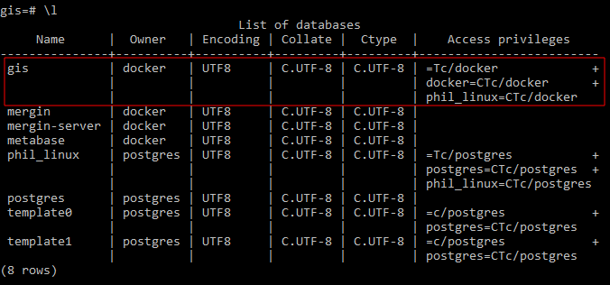

# Creating database roles and their permissions

## Deploying the initial stack

In your server terminal, deploy the initial stack by running either `make configure-ssl-self-signed` or `make configure-letsencrypt-ssl`. The initial stack consists of the Nginx, Hugo Watcher and Watchtower services.

Use `make configure-ssl-self-signed` if you are going to use a self-signed certificate on a localhost for testing. Use `make configure-letsencrypt-ssl` if you are going to use a Let's Encrypt signed certificate on a name host for production. The `make configure-ssl-self-signed` will deploy the Nginx, Hugo Watcher and Watchtower services, but after running `make configure-letsencrypt-ssl` you will need to run `make deploy-hugo` to deploy the Nginx, Hugo Watcher and Watchtower services.

Use `make ps` to view the services running. The following services should be up:


## Deploying the PostgreSQL and PostGIS service

Deploy the PostgreSQL and  PostGIS service using `make deploy-postgres`. If you already have PostgreSQL installed on your local machine, ensure that you specify a different port number for the Postgis Public Port other than port 5432, the default port for PostgreSQL. For example, you can use the port number 5434.



Use `make ps` to view the services running. The following services should be up:



## Deploying the OSM Mirror service

### Prepare the Country PBF file and the clip area document

The PBF files for the country or region of interest can be obtained from [GeoFabrik](https://download.geofabrik.de/). The PBF file used in this workflow was for South Korea and the URL is https://download.geofabrik.de/asia/south-korea-latest.osm.pbf.

The clip area constrains any data being imported into the PostGIS database to a specific geographic area. You will need to save the clip area document as `conf/osm_conf/clip.geojson`. For best performance, a simple rectangle is best, but any complex polygon can be used. The CRS of the geojson should always be `EPSG:4326`.


You can easily create such a clip document at  https://geojson.io or by using QGIS. For this workflow the clip area document for Seoul, South Korea, was downloaded from the [southkorea/seoul-maps](https://github.com/southkorea/seoul-maps/blob/master/juso/2015/json/seoul_municipalities_geo_simple.json) repository.

### Deploy the OSM mirror service

Deploy the OSM mirror service using `make deploy-osm-mirror` and follow the subsequent prompts. Use `make ps` to view the services running. The following services should be up:


You can view the logs for the OSM mirror service using the command `make osm-mirror-logs`.

## Creating database roles

PostgreSQL manages database access permissions using the concept of roles.  A role is an entity that can own database objects and have database privileges. A role can be a database user or a group of database users. For more information on database roles see the [PostgreSQL documentation](https://www.postgresql.org/docs/13/database-roles.html).

Create a psql shell using `make db-psql-shell`. psql is a PostgreSQL interactive terminal that enables you to type in queries interactively, issue them to PostgreSQL, and see the query results. `make db-psql-shell` will create a psql session in the `db` container connected to the Postgres service `gis` database. 

To list all the Postgres service databases use `\l` or `\l+`.


To list all the user accounts or roles in the PostgreSQL database server use the meta-command `du` or `\du+`.



By default you are logged in the psql session as the user `postgres`. You can check this using `\conninfo`.



The `postgres` user has full superadmin access to the entire Postgres service instance, as seen by its role attributes. The role attributes define the access privileges a role (user) has to database objects (for example, tables and functions).



The following table gives a description of the database privileges of the user `postgres`.

**Table 1:  Postgres Role Attributes**

| Role Attribute | Description |
| :-- | :--|
| Superuser | User is permitted to bypass all permission checks, except the right to log in i.e. user can override all access restrictions within the database. |
| Create role | User is permitted to create more roles, alter and drop other roles, as well as grant or revoke membership in them. | 
| Create DB | User is permitted to create new databases. |
| Replication | User has  permission to initiate streaming replication i.e user is able to connect to the server in replication mode (physical or logical replication) and able to create or drop replication slots. | 
| Bypass RLS | User is permitted to bypasses every row-level security (RLS) policy. |

Since the user `postgres` is permitted to create new roles (users), you can proceed with creating new roles (users).

First create a personal database for the new user you want to create , `phil_linux` using `CREATE DATABASE phil_linux;` List the databases available using `\l` to verify the database has been created.



Create the new database user, `phil_linux`, and set the user's log in password using `CREATE USER phil_linux PASSWORD 'ilikecats'`. Grant the user `phil_linux` all privileges available for the database `phil_linux` using `GRANT ALL PRIVILEGES ON DATABASE "phil_linux" to phil_linux;`.  These privileges include `SELECT`, `INSERT`, `UPDATE`, `DELETE`, `TRUNCATE`, `REFERENCES`, `TRIGGER`, `CREATE`, `CONNECT`, `TEMPORARY`, `EXECUTE`, and `USAGE`. For more detail about the meanings of these privileges see the [PostgreSQL documentation](https://www.postgresql.org/docs/current/ddl-priv.html).


To grant the user access to the OSM Mirror layers and project in the `gis` database, you can also grant the user `phil_linux` all privileges available for the database `gis` using `GRANT ALL PRIVILEGES ON DATABASE "gis" to phil_linux;`. 



Grant the user `phil_linux` all privileges available for all the tables in the `public` schema of the `gis` database using `GRANT ALL PRIVILEGES ON ALL TABLES IN SCHEMA public TO phil_linux;`. Doing this while connected to the `gis` database gives the user `phil_linux` access to all tables that already exist in the database.

To ensure that the user `phil_linux` will have access to any new tables and schemas created in the `gis` database, use `ALTER DEFAULT PRIVILEGES IN SCHEMA public GRANT ALL ON TABLES TO phil_linux;`. 

## Test the new user credentials using QGIS Desktop

### Creating your local connection service file

On your local machine, the per-user connection service file can be at `~/.pg_service.conf` or the location specified by the environment variable `PGSERVICEFILE`.  Add a service to this connection service file with the following service name and connection parameters. 

```
[osgs]
dbname=gis
user=phil_linux
port=<POSTGRES_PUBLIC_PORT>
password=ilikecats
host=
sslmode=require
``` 

For the port connection parameter, use the `POSTGRES_PUBLIC_PORT` specified in the `.env` file. For the host connection parameter, use the hostname of the server where you have set up OSGS.

### Setting up your PostGIS connection in QGIS

On your local machine, open QGIS Desktop.  In your Browser Panel,  right click on the PostGIS option and click on "New Connection". This will open the Create a New PostGIS Connection dialogue.


In the Connection Information section, give the connection an appropriate name. For the service, enter the service name that you specified in the [connection service file](#creating-your-local-connection-service-file). Set the SSL mode to `require` and ensure you have enabled the `Also list tables with no geometry` and the `Allow saving/loading QGIS projects in database` options. Once all the configuration options have been set, click on "Test Connection". Once you see the `Connection to <Name> was successful` message, click "OK". You have now successfully connected to the PostgreSQL and PostGIS service `gis` database as the new database user you have created. 


