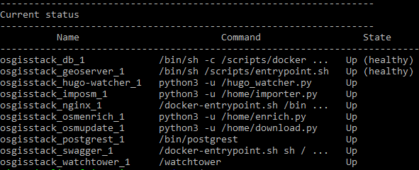
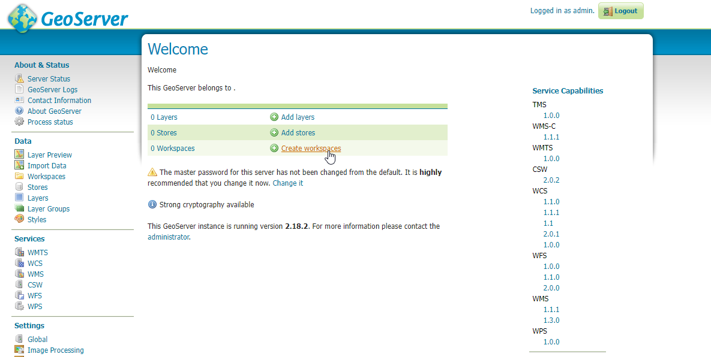
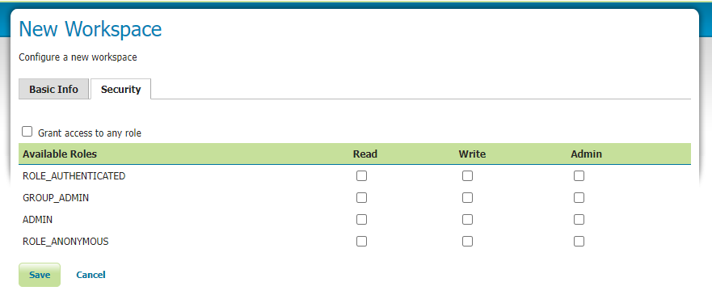
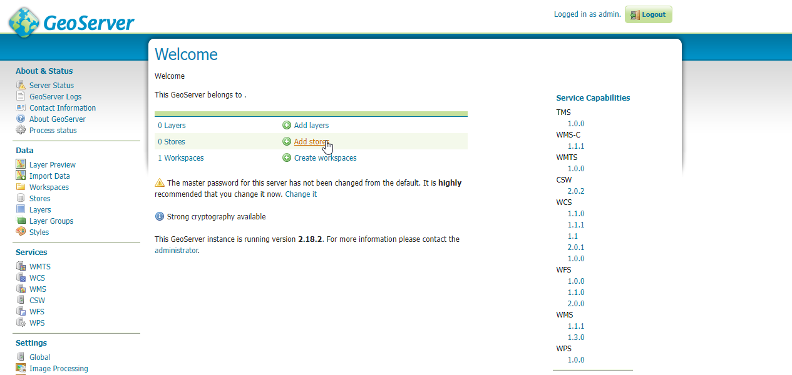
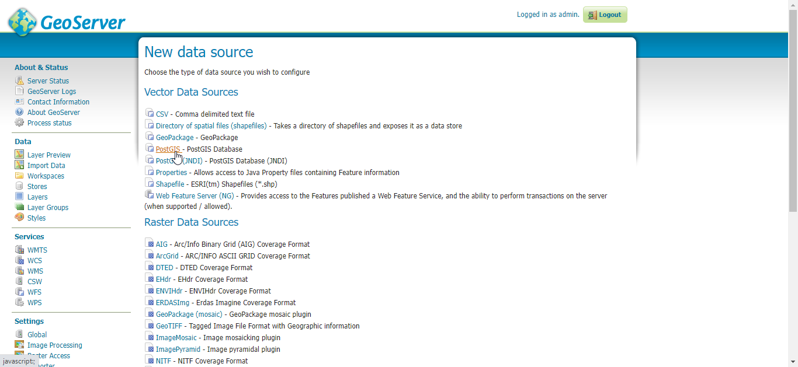
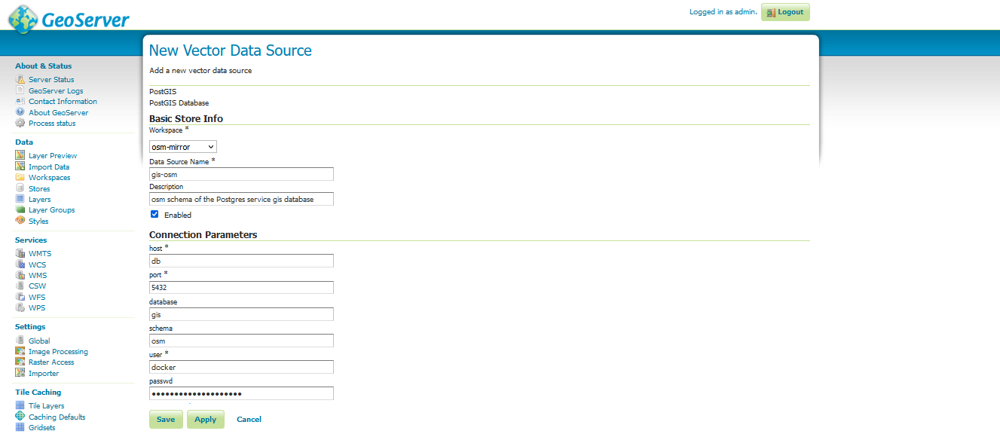
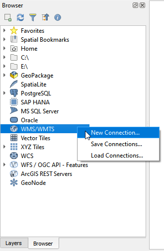
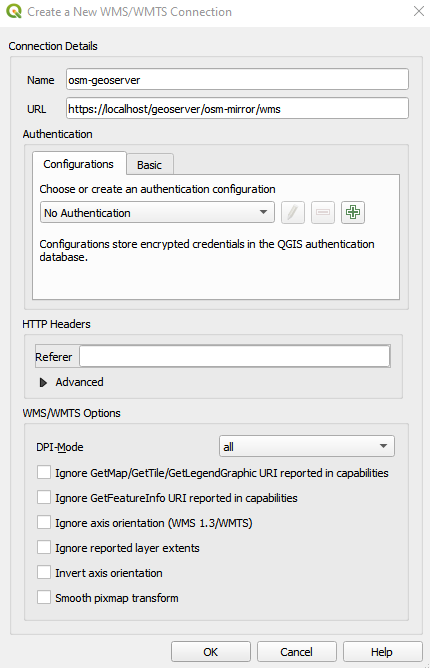

# Publishing layers using GeoServer

In this workflow, you will publish the `osm_waterways_rivers` OpenStreetMap layer in the `osm` schema of the Postgres service `gis` database.

## Deploying the OSM Mirror service

### Prepare the Country PBF file and the clip area document

The PBF files for the country or region of interest can be obtained from [GeoFabrik](https://download.geofabrik.de/). The PBF file used in this workflow was for South Korea and the URL is https://download.geofabrik.de/asia/south-korea-latest.osm.pbf.

The clip area constrains any data being imported into the PostGIS database to a specific geographic area. You will need to save the clip area document as `conf/osm_conf/clip.geojson`. For best performance, a simple rectangle is best, but any complex polygon can be used. The CRS of the geojson should always be `EPSG:4326`.


You can easily create such a clip document at  https://geojson.io or by using QGIS. For this workflow the clip area document for Seoul, South Korea, was downloaded from the [southkorea/seoul-maps](https://github.com/southkorea/seoul-maps/blob/master/juso/2015/json/seoul_municipalities_geo_simple.json) repository.

### Deploy the initial stack

In your server terminal, deploy the initial stack by running either `make configure-ssl-self-signed` or `make configure-letsencrypt-ssl`. The initial stack consists of the Nginx, Hugo Watcher and Watchtower services.

Use `make configure-ssl-self-signed` if you are going to use a self-signed certificate on a localhost for testing. Use `make configure-letsencrypt-ssl` if you are going to use a Let's Encrypt signed certificate on a name host for production. The `make configure-ssl-self-signed` will deploy the Nginx, Hugo Watcher and Watchtower services, but after running `make configure-letsencrypt-ssl` you will need to run `make deploy-hugo` to deploy the Nginx, Hugo Watcher and Watchtower services.

Use `make ps` to view the services running. The following services should be up:


### Deploy the PostgreSQL and PostGIS service

Deploy the PostgreSQL and  PostGIS service using `make deploy-postgres`. If you already have PostgreSQL installed on your local machine, ensure that you specify a different port number for the Postgis Public Port other than port 5432, the default port for PostgreSQL. For example, you can use the port number 5434.


Use `make ps` to view the services running. The following services should be up:


To view the PostgreSQL and PostGIS service databases, create a psql shell in the `gis` database using `make db-psql-shell` then use the meta command `\l` to list all the databases.


### Deploy the OSM mirror service

Deploy the OSM mirror service using `make deploy-osm-mirror` and follow the subsequent prompts. Use `make ps` to view the services running. The following services should be up:


You can view the logs for the OSM mirror service using the command `make osm-mirror-logs`.

## Deploying the GeoServer service

Deploy the GeoServer service using `make deploy-geoserver`. The service is now accessible on `/geoserver/` e.g. `https://localhost/geoserver/`. Use the `<GEOSERVER_ADMIN_USER>` and `<GEOSERVER_ADMIN_PASSWORD>` specified in the `.env` file to sign into GeoServer. 

Use `make ps` to view the services running. The following services should be up:



## Publishing Layers with GeoServer

### Create a new workspace

After signing in, there will be 3 options on the Welcome webpage: "Add layers", "Add stores", or "Create workspaces". Click on "Create Workspaces".



Name the new workspace `osm-mirror`. For the Namespace URI, use the format `https://<server>/geoserver/osm-mirror/` with the server parameter being the hostname of the server where you set up OSGS.


Check/uncheck checkboxes in the Security tab to set data access rules at the workspace level as required.



Once you are done defining your new workspace, click "Save".

### Create a new data store

Return to the Welcome page and click on the plus icon with "Add store" next to it.



In the Vector Data Sources category, select "PostGIS - PostGIS Database".



In GeoServer, every PostGIS store must be connected with just one schema. In this workflow, you will publish the `osm_waterways_rivers` layer which is in the `osm` schema hence you will create a vector data store in the `osm-mirror` workspace connected to the `osm` schema.

Name your new vector data source `gis-osm`. For the connection parameters, specify the following:

```
host : db
port : 5432
database : gis
schema : osm
user : <POSTGRES_USER>
passwd : <POSTGRES_PASSWORD>
```

The `<POSTGRES_USER>` and `<POSTGRES_PASSWORD>` are specified in the `.env` file.



Also, be sure to scroll down and set the SSL mode to `REQUIRE` then click on "SAVE".


From the list of layers in the New Layer page, search for the `osm_waterways_rivers` layer using the search bar and click on "Publish".


Complete the layer details as appropriate and make sure to click the options highlighted in red in the image below. Click on "Save" once you are finished.


## Using QGIS Desktop as a web service client for GeoServer published layers

You can connect to GeoServer from QGIS using WFS or WMS using the scheme: `https://<server>/geoserver/<workspace>/wfs` or `https://<server>/geoserver/<workspace>/wms` where `<server>` is the hostname of the server where you set up OSGS and `<workspace>` is the name of the workspace you created in the previous [section](#create-a-new-workspace).

In your QGIS Desktop Browser Panel, right click on the WMS/WMTS option and click on New Connection.



Give the connection an appropriate name and set the URL using the WMS schema as shown below. Click on "OK".



You can drag and drop the layer onto the Map View, to view the layer.


