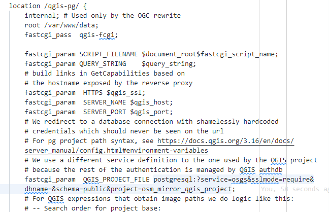
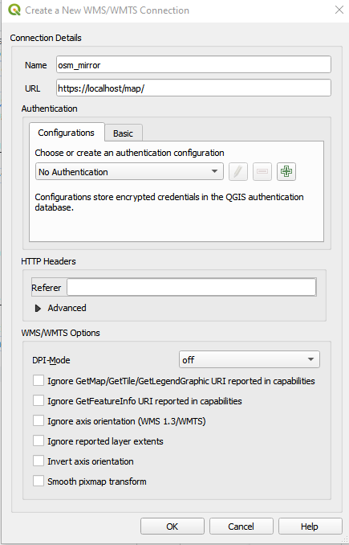
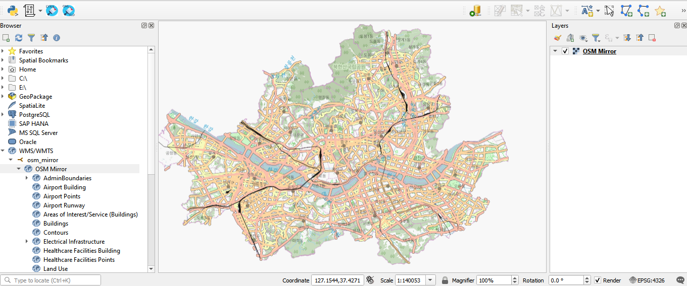

# Publishing a QGIS project using a connection service file

This workflow will demonstrate how to publish a QGIS project where the layers are inside of a PostgreSQL database. This involves uploading a QGIS project file through the pg_service file for authentication then publishing the map. The project used in this workflow is the OSM Mirror QGIS project, `osm_mirror_qgis_project`, in the `public` schema of the Postgres service `gis` database.

## Deploy OSM Mirror

Deploy the initial stack, the PostgreSQL and PostGIS service, and the OSM Mirror service using the instructions detailed in the [Creating an Open Street Map mirror into your database workflow](https://kartoza.github.io/osgs/workflows/create-osm-mirror-in-database.html).

## Deploy QGIS Server

To deploy the QGIS Server service, run `make deploy-qgis-server`.

### Creating the server-side connection service file

To create the server-side connection service file, run the command `cp conf/pg_conf/pg_service.conf.example conf/pg_conf/pg_service.conf` in the terminal. In the `conf/pg_conf/pg_service.conf` file, add a service with the following service name and connection parameters.

```
[osgs]
dbname=gis
user=docker
port=<POSTGRES_PRIVATE_PORT>
password=<POSTGRES_PASSWORD>
host=db
sslmode=require
```

For the port and password connection parameters, use the `POSTGRES_PRIVATE_PORT` and `POSTGRES_PASSWORD` specified in the `.env` file. For the host connection parameter specify the hostname as `db`.

## Edit the `qgis-server.conf` file

Edit the `conf/nginx_conf/locations/qgis-server.conf` file by replacing the default PostgreSQL connection string `postgresql://?service=nginx&sslmode=disable&schema=public&project=smallholding` in the `location /qgis-pg/` section of the file with the PostgreSQL connection string `postgresql:?service=osgs&sslmode=require&dbname=&schema=public&project=osm_mirror_qgis_project` and save the changes.



Restart the QGIS Server service using `make restart-qgis-server`.

## Accessing the QGIS project

In your QGIS Desktop Browser panel, right click on the `WMS/WMTS` option and create a new connection.


Give the new connection an appropriate name. For the URL parameter, access the published QGIS project via `/map/` i.e. `https://<server name>/map/`. Click "OK".



You can now load into QGIS the entire OSM Mirror project or individual layers.

