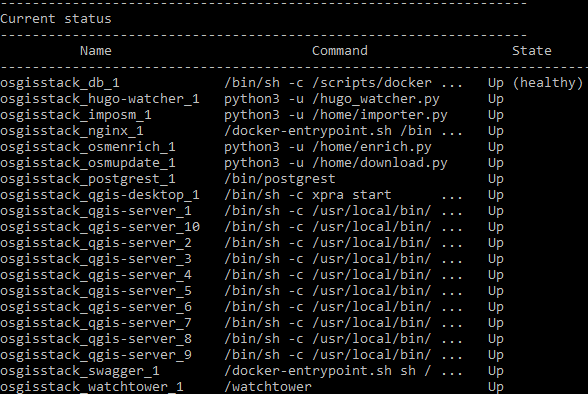
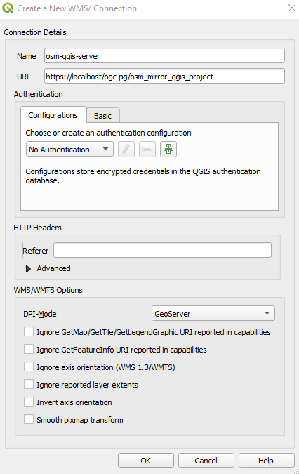

# Publishing a QGIS project using a connection service file

This workflow will demonstrate how to publish a QGIS project where the layers are inside of a PostgreSQL database. This involves uploading a QGIS project file through the pg_service file for authentication then publishing the map. The project used in this workflow is the OSM Mirror QGIS project, `osm_mirror_qgis_project`, in the `public` schema of the Postgres service `gis` database.

## Deploying the OSM Mirror service

### Prepare the Country PBF file and the clip area document

The PBF files for the country or region of interest can be obtained from [GeoFabrik](https://download.geofabrik.de/). The PBF file used in this workflow was for South Korea and the URL is https://download.geofabrik.de/asia/south-korea-latest.osm.pbf.

The clip area constrains any data being imported into the PostGIS database to a specific geographic area. You will need to save the clip area document as `conf/osm_conf/clip.geojson`. For best performance, a simple rectangle is best, but any complex polygon can be used. The CRS of the geojson should always be `EPSG:4326`.


You can easily create such a clip document at  https://geojson.io or by using QGIS. For this workflow the clip area document for Seoul, South Korea, was downloaded from the [southkorea/seoul-maps](https://github.com/southkorea/seoul-maps/blob/master/juso/2015/json/seoul_municipalities_geo_simple.json) repository.

### Deploy the initial stack

In your server terminal, deploy the initial stack by running either `make configure-ssl-self-signed` or `make configure-letsencrypt-ssl`. The initial stack consists of the Nginx, Hugo Watcher and Watchtower services.

Use `make configure-ssl-self-signed` if you are going to use a self-signed certificate on a localhost for testing. Use `make configure-letsencrypt-ssl` if you are going to use a Let's Encrypt signed certificate on a name host for production. The `make configure-ssl-self-signed` will deploy the Nginx, Hugo Watcher and Watchtower services, but after running `make configure-letsencrypt-ssl` you will need to run `make deploy-hugo` to deploy the Nginx, Hugo Watcher and Watchtower services.

Use `make ps` to view the services running. The following services should be up:


### Deploy the PostgreSQL and PostGIS service

Deploy the PostgreSQL and  PostGIS service using `make deploy-postgres`. If you already have PostgreSQL installed on your local machine, ensure that you specify a different port number for the Postgis Public Port other than port 5432, the default port for PostgreSQL. For example, you can use the port number 5434.


Use `make ps` to view the services running. The following services should be up:


To view the PostgreSQL and PostGIS service databases, create a psql shell in the `gis` database using `make db-psql-shell` then use the meta command `\l` to list all the databases.


### Deploy the OSM mirror service

Deploy the OSM mirror service using `make deploy-osm-mirror` and follow the subsequent prompts. Use `make ps` to view the services running. The following services should be up:


You can view the logs for the OSM mirror service using the command `make osm-mirror-logs`.

### Creating the server-side connection service file

To create the server-side connection service file, run the command `cp conf/pg_conf/pg_service.conf.example conf/pg_conf/pg_service.conf` in the terminal. In the `conf/pg_conf/pg_service.conf` file, add a service with the following service name and connection parameters.

```
[osgs]
dbname=gis
user=docker
port=<POSTGRES_PRIVATE_PORT>
password=<POSTGRES_PASSWORD>
host=db
sslmode=require
```

For the port and password connection parameters, use the `POSTGRES_PRIVATE_PORT` and `POSTGRES_PASSWORD` specified in the `.env` file. For the host connection parameter specify the hostname as `db`.

## Deploying QGIS Server

To deploy the QGIS Server service, run `make deploy-qgis-server`. Use `make ps` to view the services running. The following services should be up:



You can view the logs for the QGIS Server service using `make qgis-server-logs`.

## Using QGIS Desktop as a web service client for QGIS Server published layers

In your QGIS Desktop Browser panel, right click on the `WMS/WMTS` option and create a new connection.


Give the new connection an appropriate name. For the URL parameter, access the published QGIS project via `/ogc-pg/` i.e. `https://<server name>/ogc-pg/<QGIS project name>`. The `<server name>` parameter is the hostname of the server where you set up OSGS. The `<QGIS project name>` parameter is the name of the QGIS project you would like to publish. The project should be located in the `public` schema of the `gis` database. Click "OK".



Once the connection is successful, you can now load into QGIS the entire OSM Mirror QGIS project or individual layers from the project as WMS layers. Drag and drop the `OSM Mirror` layer onto the Map View to view the project.


