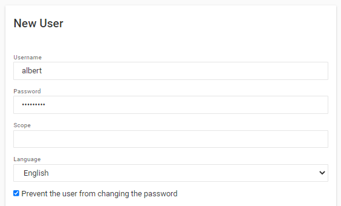
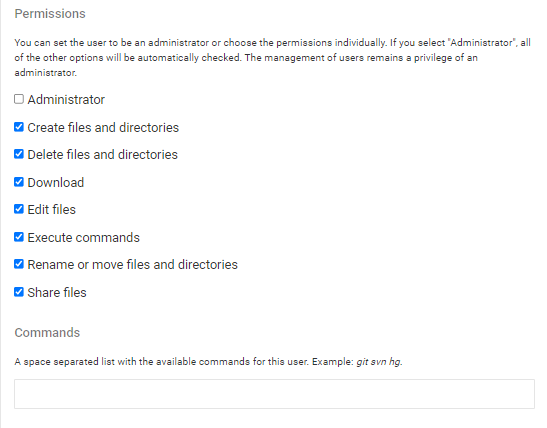
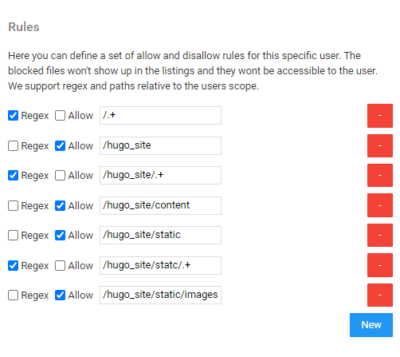
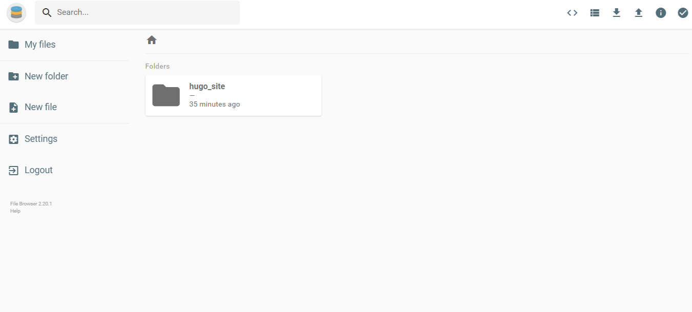

# Setting up access permissions for users in File Browser

The File Browser service is used as the backend for managing the content that appear on the OSGS static website. In some cases, you may want to have additional users that can write articles, upload maps etc. Thankfully, File Browser includes a granular permissions system, so you can give particular users access only to specific folders. The best explanation comes from this [issue thread](https://github.com/filebrowser/filebrowser/issues/1034#issuecomment-667742701).

For blogging, we need to give users access to the `hugo_site/content` and `hugo_site/static/images` folders. This workflow describes how to do so.

## Deploy the initial stack

In your server terminal, deploy the initial stack by running either `make configure-ssl-self-signed` or `make configure-letsencrypt-ssl`. The initial stack consists of the Nginx, Hugo Watcher and Watchtower services.

Use `make configure-ssl-self-signed` if you are going to use a self-signed certificate on a localhost for testing. Use `make configure-letsencrypt-ssl` if you are going to use a Let's Encrypt signed certificate on a name host for production. The `make configure-ssl-self-signed` will deploy the Nginx, Hugo Watcher and Watchtower services, but after running `make configure-letsencrypt-ssl` you will need to run `make deploy-hugo` to deploy the Nginx, Hugo Watcher and Watchtower services.

Use `make ps` to view the services running. The following services should be up:

## Deploy the File Browser service

To deploy the File Browser service run `make deploy-file-browser`. 

Use `make ps` to view the services running. The following services should be up:

The file browser service can now be accessed on `/files/` e.g. https://localhost/files. The url will direct you to the Login page. Sign in to the service using the File Browser username `admin` and password `<FILEBROWSER_PASSWORD>` specified in the `.env` file.

## Adding a user and setting up access permissions

From the File Browser home page, select Settings >> User Management >> New.

In the New User dialog, specify the username and password of the new user, the scope for the user and the language. You can also set whether the user can be able to change the password.

For the Permissions, you can accept the defaults or change them accordingly. For this workflow, we will accept the the default permissions:

In the rules section, click on New and add the following rules for the user.

Once complete, click Save then logout as the admin and log in as the new user. Based on the rules set for the user, the new user has access to only the  `hugo_site/content` and `hugo_site/static/images` folders.

You can use the same approach to granularly assign permissions to any part of the file tree published by the File Browser service.
