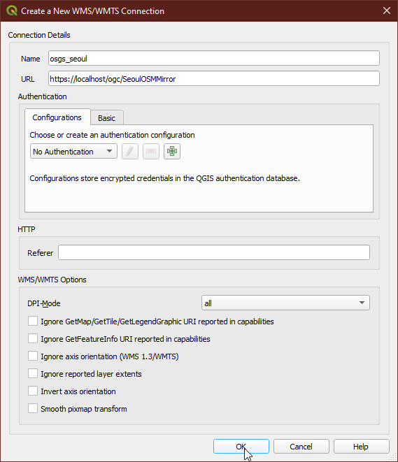

# Uploading a QGIS project

This workflow demonstrates how to publish a QGIS project in a folder/directory.

The GeoPackage  and QGIS project used in this workflow are located in the `qgis_projects/SeoulOSMMirror/` folder. The vector data used in this workflow was acquired from OpenStreetMap using the [Docker OSM mirror service](https://kartoza.github.io/osgs/workflows/create-osm-mirror-in-database.html). The layers were then exported from the Postgres service `gis` database into a GeoPackage using the ogr2ogr tool. The `clip.geojson` file used to get the OpenStreetMap data for Seoul, South Korea, was obtained from [southkorea/seoul-maps](https://github.com/southkorea/seoul-maps/blob/master/juso/2015/json/seoul_municipalities_geo_simple.json).

## Deploy the initial stack and QGIS Server

In your server terminal, deploy the initial stack by running either `make configure-ssl-self-signed` or `make configure-letsencrypt-ssl`. The initial stack consists of the Nginx, Hugo Watcher and Watchtower services.

Use `make configure-ssl-self-signed` if you are going to use a self-signed certificate on a localhost for testing. Use `make configure-letsencrypt-ssl` if you are going to use a Let's Encrypt signed certificate on a name host for production. The `make configure-ssl-self-signed` will deploy the Nginx, Hugo Watcher and Watchtower services, but after running `make configure-letsencrypt-ssl` you will need to run `make deploy-hugo` to deploy the Nginx, Hugo Watcher and Watchtower services.

To deploy the QGIS Server Service, run `make deploy-qgis-server`.

## Prepare the QGIS project

Place the QGIS project file and its associated vector and/or raster data in a named directory that matches the name of the QGIS project file. In this workflow, the `SeoulOSMMirror.qgz` QGIS project file and the `SeoulOSMMirror.gpkg` GeoPackage file are in the directory `SeoulOSMMirror`.

## Deploy the File Browser service and upload the QGIS project

To deploy the File Browser service run `make deploy-file-browser`. The file browser service can now be accessed on `/files/` e.g. https://localhost/files. The URL will direct you to the Login page. Sign in to the service using the File Browser username `admin` and password `<FILEBROWSER_PASSWORD>` specified in the `.env` file.

Navigate into the `qgis_projects` folder, click on the upload button and upload the directory/folder containing the QGIS project file to be published.

## Accessing the QGIS project on the OGC link

We can now access the QGIS project on the OGC link. In your QGIS Desktop Browser panel, right click on the `WMS/WMTS` option and create a new connection.

Give the new connection an appropriate name. For the URL parameter, access the published QGIS project via `/ogc/SeoulOSMMirror` i.e. `https://<server name>/ogc/<QGIS project name>/`. The `<server name>` parameter is the hostname of the server where you set up OSGS. Click "Ok".

Once the connection is successful, you can now load into QGIS the entire published QGIS project or individual layers as WMS layers. Drag and drop the `SeoulOSMMirror` layer onto the QGIS workspace to view the project.

